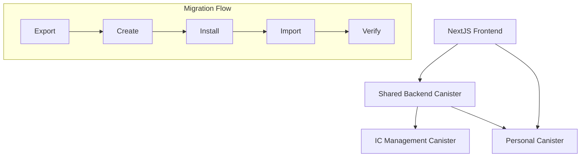

# Design Document

## Overview

This design implements capsule migration functionality that allows users to create personal canisters containing their capsule data. The system provides internal data transfer capabilities, personal canister creation with admin-funded cycles, and seamless integration with the existing backend architecture. The design prioritizes MVP simplicity while ensuring core functionality works reliably.

## Architecture

### High-Level Architecture



### Component Interaction

The migration system consists of:

1. **Migration Module**: Handles the core migration logic
2. **Internal Data Transfer**: Manages data export and import between canisters
3. **Canister Factory Module**: Creates and configures new canisters

## Components and Interfaces

### Migration Module (`canister_factory.rs`)

This module will be added to the existing backend and provide the core migration functionality.

#### Key Types

```rust
#[derive(CandidType, Serialize, Deserialize)]
pub struct MigrationResponse {
    pub success: bool,
    pub canister_id: Option<Principal>,
    pub message: String,
}

#[derive(CandidType, Serialize, Deserialize)]
pub enum MigrationStatus {
    NotStarted,
    Exporting,
    Creating,
    Installing,
    Importing,
    Verifying,
    Completed,
    Failed,
}

#[derive(CandidType, Serialize, Deserialize)]
pub struct MigrationStatusResponse {
    pub status: MigrationStatus,
    pub canister_id: Option<Principal>,
    pub message: Option<String>,
}

#[derive(CandidType, Serialize, Deserialize)]
pub struct ExportData {
    pub capsule: types::Capsule,
    pub memories: Vec<(String, types::Memory)>,
    pub connections: Vec<(types::PersonRef, types::Connection)>,
    pub metadata: ExportMetadata,
}

#[derive(CandidType, Serialize, Deserialize)]
pub struct ExportMetadata {
    pub export_timestamp: u64,
    pub original_canister_id: Principal,
    pub data_version: String,
    pub total_size_bytes: u64,
}
```

#### Core Functions

```rust
// Migration functions
pub async fn migrate_capsule() -> Result<MigrationResponse, String>;
pub fn get_migration_status() -> Option<MigrationStatusResponse>;

// Admin functions
pub fn set_migration_enabled(enabled: bool) -> Result<(), String>;
pub fn get_migration_stats() -> MigrationStats;
```

### Internal Data Transfer

The system uses internal canister-to-canister communication for data transfer (no user-facing downloads).

#### Import API on Personal Canister

```rust
// Import session management
pub fn begin_import() -> Result<String, String>; // returns session_id
pub fn put_memory_chunk(
    session_id: String,
    memory_id: String,
    chunk_index: u32,
    bytes: Vec<u8>,
    sha256: String
) -> Result<(), String>;
pub fn commit_memory(session_id: String, manifest: MemoryManifest) -> Result<(), String>;
pub fn finalize_import(session_id: String) -> Result<(), String>;
```

### Canister Factory Integration

#### Personal Canister Configuration

```rust
#[derive(CandidType, Serialize, Deserialize)]
pub struct PersonalCanisterConfig {
    pub wasm_module: Vec<u8>, // Single personal-canister WASM
    pub init_data: ExportData,
    pub cycles_funding: u128, // From factory reserve
    pub controllers: Vec<Principal>, // Start with {factory, user}
}
```

#### Minimal Creation Config

```rust
#[derive(CandidType, Serialize, Deserialize, Default, Clone)]
pub struct CreatePersonalCanisterConfig {
    pub name: Option<String>,
    pub subnet_id: Option<Principal>,
}
```

#### Guards and Access Control

```rust
pub fn ensure_owner(caller: Principal) -> Result<(), String> { /* check caller owns capsule */ }
pub fn ensure_admin(caller: Principal) -> Result<(), String> { /* check caller is admin */ }
```

#### Reserve Preflight

```rust
pub fn preflight_cycles_reserve(required: u128) -> Result<(), String> {
    STATE.with(|s| {
        let st = s.borrow();
        if st.migration_config.cycles_reserve < st.migration_config.min_cycles_threshold
            || st.migration_config.cycles_reserve < required
        {
            return Err("insufficient cycles in reserve".to_string());
        }
        Ok(())
    })
}
```

#### Creation Process

1. **Check Factory Reserve**: Verify sufficient cycles in factory reserve (preflight)
2. **Export Data**: Serialize user's capsule data internally
3. **Create Canister**: Use IC management canister with {factory, user} controllers; persist a registry record with status Creating
4. **Install WASM**: Deploy single personal-canister WASM
5. **Import Data**: Transfer data using chunked import API
6. **Verify Import**: Reconcile counts and content hashes; validate API_VERSION compatibility
7. **Handoff Controllers**: Switch to {user} only after verification
8. **Finalize Registry**: Update registry status to Completed and record cycles consumed

### Controller Handoff

```rust
pub async fn handoff_controllers(canister_id: Principal, user: Principal) -> Result<(), String> {
    // After successful verification, remove factory from controllers
    let settings = CanisterSettings {
        controllers: Some(vec![user]),
        // ... other settings remain unchanged
    };
    update_settings(&UpdateSettingsArgs {
        canister_id,
        settings,
    }).await
}
```

## Data Models

### Migration State

```rust
#[derive(CandidType, Serialize, Deserialize, Clone)]
pub struct MigrationState {
    pub user: Principal,
    pub status: MigrationStatus,
    pub created_at: u64,
    pub completed_at: Option<u64>,
    pub personal_canister_id: Option<Principal>,
    pub cycles_consumed: u128,
    pub error_message: Option<String>,
}
```

### Registry

```rust
#[derive(CandidType, Serialize, Deserialize, Clone)]
pub struct PersonalCanisterRecord {
    pub canister_id: Principal,
    pub created_by: Principal,
    pub created_at: u64,
    pub status: MigrationStatus,
    pub cycles_consumed: u128,
}
```

### Configuration

```rust
#[derive(CandidType, Serialize, Deserialize, Clone)]
pub struct MigrationConfig {
    pub enabled: bool,
    pub cycles_reserve: u128,
    pub min_cycles_threshold: u128,
    pub admin_principals: BTreeSet<Principal>,
}
```

### Storage Integration

```rust
// Extend existing State structure
#[derive(CandidType, Serialize, Deserialize, Default, Clone)]
struct State {
    // Existing fields
    // ... other existing fields

    // New migration fields
    migration_config: MigrationConfig,
    migration_states: BTreeMap<Principal, MigrationState>,
    migration_stats: MigrationStats,
    personal_canisters: BTreeMap<Principal, PersonalCanisterRecord>,
}
```

## Verification

### Data Integrity Check

```rust
pub fn verify_migration(
    source_manifest: &DataManifest,
    target_canister_id: Principal
) -> Result<bool, String> {
    // Reconcile counts and content hashes
    // On mismatch, mark Failed and keep factory as controller for cleanup
}
```

## Testing Strategy

### MVP Testing Focus

```rust
#[cfg(test)]
mod tests {
    use super::*;

    #[test]
    fn test_idempotent_migrate_capsule() {
        // Test repeated migrate_capsule calls return same result
    }

    #[test]
    fn test_controller_handoff() {
        // Test controller transition from {factory, user} to {user}
    }

    #[test]
    fn test_import_verification() {
        // Test hash validation and count reconciliation
    }

    #[test]
    fn test_cycles_reserve_check() {
        // Test factory reserve validation
    }
}
```

## Deployment Strategy

### Feature Flag

```rust
pub fn is_migration_enabled() -> bool {
    STATE.with(|s| s.borrow().migration_config.enabled)
}
```

### Backwards Compatibility

- Add-only endpoints to existing Candid interface
- Existing capsule functionality remains unchanged
- New migration state stored alongside existing data

## Encryption/VetKeys Note

Personal canister must decrypt the same data as the shared backend. If VetKeys or per-user keys are used, migration must preserve or re-wrap keys. Full key management is deferred to post-MVP; design ensures it doesn't block future key management implementation.

## Minimal Service Interface

```candid
type MigrationStatus = variant {
    NotStarted;
    Exporting;
    Creating;
    Installing;
    Importing;
    Verifying;
    Completed;
    Failed
};

service : {
    migrate_capsule : () -> (record {
        success: bool;
        canister_id: opt principal;
        message: text
    });

    get_migration_status : () -> (opt record {
        status: MigrationStatus;
        canister_id: opt principal;
        message: opt text
    }) query;
}
```
