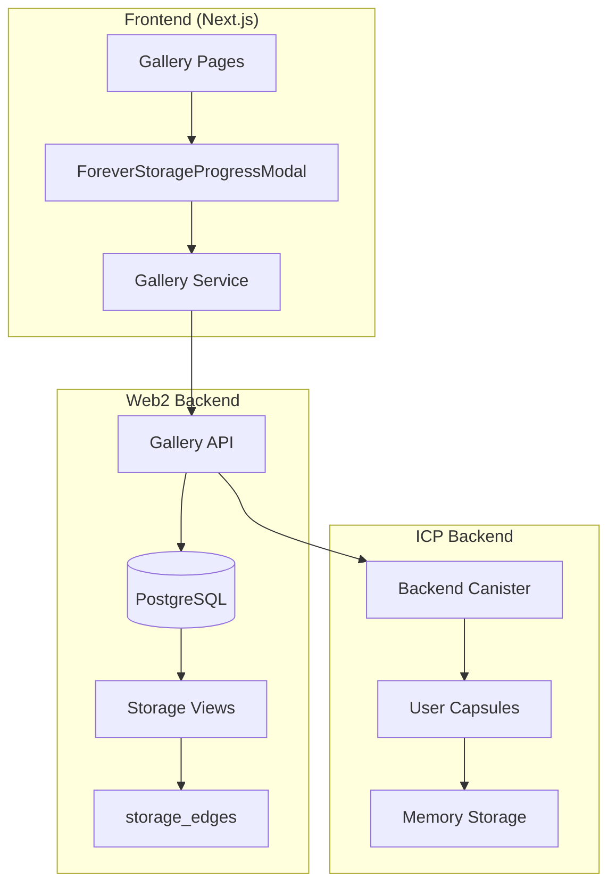
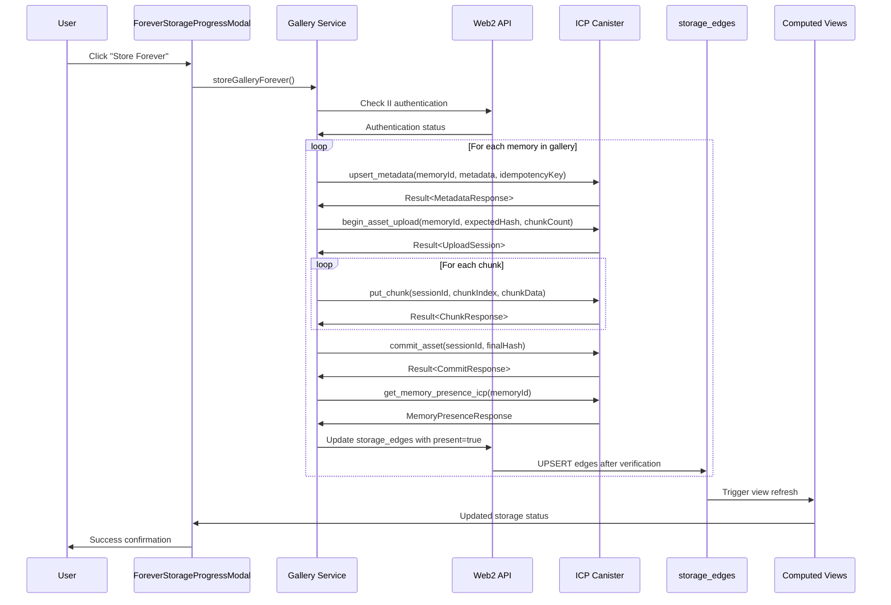

# Design Document

## Overview

The "Store Forever" feature enables users to permanently store their photo galleries on the Internet Computer (ICP) blockchain by replicating gallery data from the existing Web2 system to ICP canisters. The design builds upon the existing storage_edges architecture, ForeverStorageProgressModal UI, and ICP backend canister infrastructure to provide a seamless user experience for permanent gallery storage.

**Key Design Principles:**

- **MVP over Clean Code**: Preserve existing working patterns and make minimal necessary changes
- **Replication, not Migration**: Web2 remains the primary system; ICP is a replication target
- **Storage Edges Architecture**: Use existing storage_edges table and computed views for status tracking
- **Minimal UI Changes**: Leverage existing "Store Forever" buttons and progress modal
- **Capsule-Based Storage**: Store galleries within user capsules on ICP for data ownership
- **Idempotent Operations**: All ICP writes are safe to retry with content hash verification
- **Incremental Enhancement**: Build upon existing error handling rather than replacing it

## UUID Mapping Strategy (CRITICAL)

**Problem**: The current ICP backend generates its own IDs instead of accepting canonical UUIDs from Web2, which breaks the core requirement for shared identity between systems.

**Current Issue (❌ WRONG)**:

```rust
// ICP Backend currently does this:
let gallery_id = format!("gallery_{}", ic_cdk::api::time());  // ❌ Generates new ID
let memory_id = format!("memory_{}", ic_cdk::api::time());    // ❌ Generates new ID

// This breaks UUID mapping between Web2 and ICP!
```

**Required Solution (✅ CORRECT)**:

```rust
// ICP Backend should do this:
pub fn store_gallery_forever(gallery_data: GalleryData) -> StoreGalleryResponse {
    let gallery_id = gallery_data.gallery.id.clone();  // ✅ Use Web2 UUID
    // Don't overwrite gallery.id - it's already set by Web2!
}

pub fn add_memory_to_capsule(memory_id: String, memory_data: MemoryData) -> MemoryOperationResponse {
    // ✅ Accept memory_id parameter from Web2
    // Use the canonical UUID provided by Web2
}
```

**UUID Strategy Across Systems**:

1. **Web2 (PostgreSQL)**:

   - Stores UUIDs as `uuid` type (16-byte binary)
   - Generates canonical lowercase hyphenated UUID v4 format
   - Example: `550e8400-e29b-41d4-a716-446655440000`

2. **ICP Canister**:

   - Accepts UUIDs as `String` type (canonical string form)
   - Must NOT generate new IDs - accepts from Web2
   - Uses same UUID format as Web2

3. **Frontend**:

   - Treats UUIDs as strings throughout
   - No conversion needed - passes UUIDs between systems

4. **Conversion**:
   - PostgreSQL → ICP: Use `uuid::text` for string conversion
   - ICP → PostgreSQL: Direct string to UUID conversion

**Idempotency Through UUID Sharing**:

```rust
// Check if entity already exists with this UUID
if let Some(existing_gallery) = get_gallery_by_id(gallery_id.clone()) {
    return StoreGalleryResponse {
        success: true,
        gallery_id: Some(gallery_id),
        message: "Gallery already exists with this UUID".to_string(),
        // Return success for idempotent operation
    };
}
```

**Required ICP Backend Changes**:

- Remove all ID generation logic (`format!("gallery_{}", time)`)
- Accept external UUIDs in function parameters
- Don't overwrite `gallery.id` or `memory.id` fields
- Add idempotent checks for existing UUIDs
- Update function signatures to accept `memory_id: String` parameter

**Function Signature Updates**:

```rust
// Gallery Functions - no signature change needed, just behavior change:
pub fn store_gallery_forever(gallery_data: GalleryData) -> StoreGalleryResponse {
    // Use gallery_data.gallery.id instead of generating new ID
}

// Memory Functions - signature change required:
// CURRENT: pub fn add_memory_to_capsule(memory_data: MemoryData) -> MemoryOperationResponse
// REQUIRED: pub fn add_memory_to_capsule(memory_id: String, memory_data: MemoryData) -> MemoryOperationResponse
```

**Files Requiring Changes**:

- `src/backend/src/capsule.rs` - Remove ID generation, accept external UUIDs
- `src/backend/src/types.rs` - No changes needed (already uses String)
- All functions that create galleries/memories need UUID acceptance logic

## Architecture

### High-Level Architecture



### Data Flow Architecture



## Components and Interfaces

### 0. MVP Error Handling Strategy

**Existing Patterns to Preserve:**

- `MemoryResponse { success: bool, data: Option<String>, error: Option<String> }`
- `CapsuleCreationResult { success: bool, capsule_id: Option<String>, message: String }`
- Boolean return types for simple operations

**Minimal New Error Model:**

```rust
// Essential error codes for ICP operations only
#[derive(CandidType, Deserialize, Serialize, Clone, Debug)]
pub enum ICPErrorCode {
    Unauthorized,
    AlreadyExists,
    NotFound,
    InvalidHash,
    Internal(String),
}

// Lightweight result wrapper for new ICP endpoints
#[derive(CandidType, Deserialize, Serialize, Clone, Debug)]
pub struct ICPResult<T> {
    pub success: bool,
    pub data: Option<T>,
    pub error: Option<ICPErrorCode>,
}

// Extend existing types where needed
#[derive(CandidType, Deserialize, Serialize, Clone, Debug)]
pub struct MemoryPresenceResponse {
    pub success: bool,
    pub metadata_present: bool,
    pub asset_present: bool,
    pub error: Option<ICPErrorCode>, // Add to existing structure
}
```

**Implementation Strategy:**

- Keep existing error handling for all current functionality
- Add ICPErrorCode only to new ICP-specific endpoints
- Convert between patterns at API boundaries
- Maintain backward compatibility with existing tests

### 1. Frontend Components

#### 1.1 Existing Components (No Changes Required)

- **Gallery Detail Page** (`src/nextjs/src/app/[lang]/gallery/[id]/page.tsx`)

  - Contains "Store Forever" button
  - Handles ForeverStorageProgressModal integration
  - Auto-opens modal on II linking return

- **Gallery Preview Page** (`src/nextjs/src/app/[lang]/gallery/[id]/preview/page.tsx`)

  - Contains "Store Forever" button in sticky header
  - Same modal integration as detail page

- **ForeverStorageProgressModal** (`src/nextjs/src/components/galleries/ForeverStorageProgressModal.tsx`)
  - Step-by-step progress UI (auth, prepare, store, verify, success)
  - II authentication flow integration
  - Error handling and retry functionality

#### 1.2 Memory Storage Badge Components

**Memory Storage Badge Component** (`src/nextjs/src/components/memory-storage-badge.tsx`)

```typescript
// Individual memory storage status badge for thumbnails
interface MemoryStorageBadgeProps {
  memoryId: string;
  memoryType: string;
  className?: string;
  size?: "sm" | "md";
}

export function MemoryStorageBadge({ memoryId, memoryType, className, size = "sm" }: MemoryStorageBadgeProps) {
  const { data: storageStatus, isLoading } = useMemoryStorageStatus(memoryId, memoryType);

  if (isLoading) return <Skeleton className="w-8 h-4" />;

  const badgeVariant =
    storageStatus?.overallStatus === "stored_forever"
      ? "success"
      : storageStatus?.overallStatus === "partially_stored"
      ? "warning"
      : "secondary";

  const badgeText =
    storageStatus?.overallStatus === "stored_forever"
      ? "ICP"
      : storageStatus?.overallStatus === "partially_stored"
      ? "ICP*"
      : "NEON";

  return (
    <TooltipProvider>
      <Tooltip>
        <TooltipTrigger asChild>
          <Badge variant={badgeVariant} className={cn("text-xs", className)} size={size}>
            {badgeText}
          </Badge>
        </TooltipTrigger>
        <TooltipContent>
          <p>{getStorageStatusTooltip(storageStatus?.overallStatus)}</p>
        </TooltipContent>
      </Tooltip>
    </TooltipProvider>
  );
}
```

**Memory Storage Status Hook** (`src/nextjs/src/hooks/use-memory-storage-status.ts`)

```typescript
// Hook for fetching individual memory storage status
export function useMemoryStorageStatus(memoryId: string, memoryType: string) {
  return useQuery({
    queryKey: ["memory-storage-status", memoryId, memoryType],
    queryFn: async () => {
      const response = await fetch(`/api/memories/${memoryId}/storage-status?type=${memoryType}`);
      if (!response.ok) throw new Error("Failed to fetch memory storage status");
      return response.json();
    },
    staleTime: 30000, // Cache for 30 seconds
    enabled: !!memoryId && !!memoryType,
  });
}

// Hook for batch memory storage status (for gallery views)
export function useBatchMemoryStorageStatus(memories: Array<{ id: string; type: string }>) {
  const memoryIds = memories.map((m) => m.id).join(",");
  const memoryTypes = memories.map((m) => m.type).join(",");

  return useQuery({
    queryKey: ["batch-memory-storage-status", memoryIds, memoryTypes],
    queryFn: async () => {
      const response = await fetch(`/api/memories/storage-status?ids=${memoryIds}&types=${memoryTypes}`);
      if (!response.ok) throw new Error("Failed to fetch batch memory storage status");
      return response.json();
    },
    staleTime: 30000,
    enabled: memories.length > 0,
  });
}
```

#### 1.3 Component Enhancements Required

**Gallery Service** (`src/nextjs/src/services/gallery.ts`)

```typescript
// Artifact-level storage implementation
async function storeGalleryOnICP(gallery: GalleryWithItems): Promise<StoreGalleryResponse> {
  const actor = await getAuthenticatedActor();
  const results: MemoryStorageResult[] = [];

  // Process each memory in the gallery (Web2 provides memory list)
  for (const item of gallery.items) {
    const memoryId = item.memory.id;
    const idempotencyKey = `${memoryId}:${item.memory.type}:${item.memory.contentHash}`;

    try {
      // 1. Store metadata
      const metadataResult = await actor.upsert_metadata(
        memoryId,
        item.memory.type,
        item.memory.metadata,
        `${idempotencyKey}:metadata`
      );

      if (metadataResult.Err && metadataResult.Err !== "AlreadyExists") {
        throw new Error(`Metadata storage failed: ${metadataResult.Err}`);
      }

      // 2. Store asset if not already present
      await storeMemoryAsset(actor, item.memory, idempotencyKey);

      // 3. Verify presence before updating edges
      const presenceResult = await actor.get_memory_presence_icp(memoryId);
      if (presenceResult.Ok?.metadata_present && presenceResult.Ok?.asset_present) {
        // 4. Update storage_edges only after verification
        await updateStorageEdges(memoryId, item.memory.type, presenceResult.Ok);
        results.push({ memoryId, success: true });
      } else {
        results.push({ memoryId, success: false, error: "Presence verification failed" });
      }
    } catch (error) {
      results.push({ memoryId, success: false, error: error.message });
    }
  }

  const successCount = results.filter((r) => r.success).length;
  return {
    success: successCount === gallery.items.length,
    gallery_id: gallery.id,
    icp_gallery_id: gallery.id,
    message: `Stored ${successCount}/${gallery.items.length} memories`,
    storage_status: successCount === gallery.items.length ? "ICPOnly" : "Partial",
  };
}

// Chunked asset upload with operational constraints
async function storeMemoryAsset(actor: ICPActor, memory: Memory, idempotencyKey: string): Promise<void> {
  const assetData = await fetchMemoryAssetData(memory.url);
  const expectedHash = computeContentHash(assetData);
  const chunkSize = 1024 * 1024; // 1MB chunks (max 2MB)
  const maxUploadSize = 100 * 1024 * 1024; // 100MB max

  if (assetData.length > maxUploadSize) {
    throw new Error(`Asset too large: ${assetData.length} bytes (max ${maxUploadSize})`);
  }

  const chunks = createChunks(assetData, chunkSize);

  // Begin upload session
  const sessionResult = await actor.begin_asset_upload(memory.id, expectedHash, chunks.length, assetData.length);

  if (sessionResult.Err) {
    if (sessionResult.Err === "AlreadyExists") {
      return; // Asset already stored with same hash
    }
    throw new Error(`Failed to begin upload: ${sessionResult.Err}`);
  }

  const sessionId = sessionResult.Ok.session_id;

  try {
    // Upload chunks with rate limiting
    for (let i = 0; i < chunks.length; i++) {
      const chunkResult = await actor.put_chunk(sessionId, i, chunks[i]);
      if (chunkResult.Err) {
        throw new Error(`Chunk ${i} failed: ${chunkResult.Err}`);
      }

      // Rate limiting: max 3 concurrent uploads per user
      if (i % 3 === 0 && i > 0) {
        await new Promise((resolve) => setTimeout(resolve, 100));
      }
    }

    // Commit upload
    const commitResult = await actor.commit_asset(sessionId, expectedHash);
    if (commitResult.Err) {
      throw new Error(`Commit failed: ${commitResult.Err}`);
    }
  } catch (error) {
    // Cancel session on error
    await actor.cancel_upload(sessionId);
    throw error;
  }
}
```

**Storage Status Integration**

```typescript
// Add storage status queries using existing views
async function getGalleryStorageStatus(galleryId: string): Promise<GalleryStorageStatus> {
  const response = await fetch(`/api/galleries/${galleryId}/storage-status`);
  return response.json();
}

// Update gallery cards to show storage badges
function GalleryCard({ gallery }: { gallery: GalleryWithItems }) {
  const [storageStatus, setStorageStatus] = useState<GalleryStorageStatus>();

  useEffect(() => {
    getGalleryStorageStatus(gallery.id).then(setStorageStatus);
  }, [gallery.id]);

  return (
    <Card>
      {/* Existing gallery card content */}
      {storageStatus?.icp_complete && <Badge variant="success">Stored Forever</Badge>}
      {storageStatus?.partial && <Badge variant="warning">Partially on ICP</Badge>}
    </Card>
  );
}
```

### 2. Backend API Components

#### 2.1 Storage Status API Endpoints

**Design Considerations for Storage Status APIs:**

The storage status API endpoints serve as the bridge between the frontend UI components and the database views that track ICP storage progress. These endpoints must be highly optimized since they'll be called frequently for gallery lists, detail pages, and real-time progress updates.

**Performance Requirements:**

- Sub-100ms response times for single gallery/memory queries
- Batch endpoints must handle up to 100 items efficiently
- Leverage existing optimized database views (`memory_presence`, `gallery_presence`)
- Implement proper caching strategies for frequently accessed data

**Security & Access Control:**

- All endpoints require authentication via NextAuth session
- Gallery endpoints: User must own gallery OR have shared access (public/direct/group/relationship)
- Memory endpoints: User must own memory OR have access via gallery sharing
- Batch endpoints: Filter results to only include accessible items (no 403 errors for inaccessible items)

**API Design Patterns:**

- Consistent response format: `{ success: boolean, data: T, error?: string }`
- HTTP status codes: 200 (success), 401 (unauthorized), 404 (not found), 400 (bad request), 500 (server error)
- Query parameters for filtering and pagination
- Reuse existing utilities and maintain consistency with current API patterns

**Detailed API Specifications:**

**1. GET /api/galleries/[id]/storage-status**

```typescript
// Purpose: Get storage status for a specific gallery
// Authentication: Required (user must have gallery access)
// Performance: Uses optimized gallery_presence view
export async function GET(request: Request, { params }: { params: { id: string } }) {
  const session = await auth();
  if (!session?.user?.id) return Response.json({ error: "Unauthorized" }, { status: 401 });

  const galleryId = params.id;

  // Check gallery access (owner, public, or shared)
  const hasAccess = await checkGalleryAccess(galleryId, session.user.id);
  if (!hasAccess) return Response.json({ error: "Gallery not found" }, { status: 404 });

  // Query gallery_presence view for optimized storage status
  const result = await db.execute(getGalleryPresenceById(galleryId));
  const status = result.rows[0] as DBGalleryPresence;

  return Response.json({
    success: true,
    data: {
      galleryId,
      totalMemories: status?.total_memories || 0,
      icpCompleteMemories: status?.icp_complete_memories || 0,
      icpComplete: status?.icp_complete || false,
      icpAny: status?.icp_any || false,
      icpCompletePercentage: status ? Math.round((status.icp_complete_memories / status.total_memories) * 100) : 0,
      status: status?.icp_complete ? "stored_forever" : status?.icp_any ? "partially_stored" : "web2_only",
      lastUpdated: new Date(),
    },
  });
}
```

**2. GET /api/memories/[id]/storage-status**

```typescript
// Purpose: Get storage status for a specific memory
// Authentication: Required (user must have memory access)
// Query params: ?type=image|video|note|document|audio (required)
export async function GET(request: Request, { params }: { params: { id: string } }) {
  const { searchParams } = new URL(request.url);
  const memoryType = searchParams.get("type");
  const memoryId = params.id;

  if (!memoryType || !["image", "video", "note", "document", "audio"].includes(memoryType)) {
    return Response.json({ error: "Invalid or missing type parameter" }, { status: 400 });
  }

  // Check memory access via ownership or gallery sharing
  const hasAccess = await checkMemoryAccess(memoryId, memoryType, session.user.id);
  if (!hasAccess) return Response.json({ error: "Memory not found" }, { status: 404 });

  // Query memory_presence view
  const result = await db.execute(getMemoryPresenceById(memoryId, memoryType));
  const presence = result.rows[0] as DBMemoryPresence;

  return Response.json({
    success: true,
    data: {
      memoryId,
      memoryType,
      metaNeon: presence?.meta_neon || false,
      assetBlob: presence?.asset_blob || false,
      metaIcp: presence?.meta_icp || false,
      assetIcp: presence?.asset_icp || false,
      storageStatus: {
        neon: presence?.meta_neon || false,
        blob: presence?.asset_blob || false,
        icp: (presence?.meta_icp && presence?.asset_icp) || false,
        icpPartial: presence?.meta_icp || presence?.asset_icp || false,
      },
      overallStatus:
        presence?.meta_icp && presence?.asset_icp
          ? "stored_forever"
          : presence?.meta_icp || presence?.asset_icp
          ? "partially_stored"
          : "web2_only",
    },
  });
}
```

**3. GET /api/galleries/storage-status (Batch)**

```typescript
// Purpose: Get storage status for multiple galleries
// Query params: ?ids=gallery1,gallery2,gallery3 (max 100)
// Authentication: Required (filters to accessible galleries only)
export async function GET(request: Request) {
  const { searchParams } = new URL(request.url);
  const idsParam = searchParams.get("ids");

  if (!idsParam) return Response.json({ error: "Missing ids parameter" }, { status: 400 });

  const galleryIds = idsParam.split(",").slice(0, 100); // Limit to 100

  // Filter to accessible galleries only (no 403 errors)
  const accessibleGalleries = await filterAccessibleGalleries(galleryIds, session.user.id);

  // Batch query gallery_presence view
  const results = await Promise.all(
    accessibleGalleries.map(async (galleryId) => {
      const result = await db.execute(getGalleryPresenceById(galleryId));
      const status = result.rows[0] as DBGalleryPresence;
      return {
        galleryId,
        totalMemories: status?.total_memories || 0,
        icpComplete: status?.icp_complete || false,
        icpAny: status?.icp_any || false,
        status: status?.icp_complete ? "stored_forever" : status?.icp_any ? "partially_stored" : "web2_only",
      };
    })
  );

  return Response.json({ success: true, data: results });
}
```

**4. GET /api/memories/storage-status (Batch)**

```typescript
// Purpose: Get storage status for multiple memories
// Query params: ?ids=memory1,memory2&types=image,video (arrays must match length)
// Authentication: Required (filters to accessible memories only)
export async function GET(request: Request) {
  const { searchParams } = new URL(request.url);
  const idsParam = searchParams.get("ids");
  const typesParam = searchParams.get("types");

  if (!idsParam || !typesParam) {
    return Response.json({ error: "Missing ids or types parameter" }, { status: 400 });
  }

  const memoryIds = idsParam.split(",").slice(0, 100);
  const memoryTypes = typesParam.split(",").slice(0, 100);

  if (memoryIds.length !== memoryTypes.length) {
    return Response.json({ error: "ids and types arrays must have same length" }, { status: 400 });
  }

  // Filter to accessible memories and batch query
  const results = await Promise.all(
    memoryIds.map(async (memoryId, index) => {
      const memoryType = memoryTypes[index];
      const hasAccess = await checkMemoryAccess(memoryId, memoryType, session.user.id);

      if (!hasAccess) return null; // Filter out inaccessible memories

      const result = await db.execute(getMemoryPresenceById(memoryId, memoryType));
      const presence = result.rows[0] as DBMemoryPresence;

      return {
        memoryId,
        memoryType,
        overallStatus:
          presence?.meta_icp && presence?.asset_icp
            ? "stored_forever"
            : presence?.meta_icp || presence?.asset_icp
            ? "partially_stored"
            : "web2_only",
      };
    })
  );

  return Response.json({
    success: true,
    data: results.filter(Boolean), // Remove null entries
  });
}
```

**Error Handling Strategy:**

- 401 Unauthorized: Missing or invalid authentication
- 404 Not Found: Gallery/memory doesn't exist or user lacks access
- 400 Bad Request: Invalid parameters (malformed UUIDs, invalid types, etc.)
- 500 Internal Server Error: Database errors, view query failures
- Rate Limiting: Implement per-user rate limits for batch endpoints (100 requests/minute)

**Caching Strategy:**

- Cache gallery presence data for 30 seconds (storage status changes infrequently)
- Use Redis or in-memory cache for frequently accessed galleries
- Implement cache invalidation on storage_edges updates
- Consider ETags for conditional requests to reduce bandwidth

**Storage Edges Update Endpoint** (`/api/storage/edges`)

```typescript
// POST /api/storage/edges
export async function POST(request: Request) {
  const { galleryId, memoryArtifacts } = await request.json();

  // Batch upsert storage_edges
  const edges = memoryArtifacts.map((artifact) => ({
    memoryId: artifact.memoryId,
    memoryType: artifact.memoryType,
    artifact: artifact.artifact, // 'metadata' | 'asset'
    backend: "icp-canister" as const,
    present: true,
    syncState: "idle" as const,
    location: artifact.location,
    contentHash: artifact.contentHash,
    lastSyncedAt: new Date(),
  }));

  await db
    .insert(storageEdges)
    .values(edges)
    .onConflictDoUpdate({
      target: [storageEdges.memoryId, storageEdges.memoryType, storageEdges.artifact, storageEdges.backend],
      set: {
        present: excluded(storageEdges.present),
        syncState: excluded(storageEdges.syncState),
        location: excluded(storageEdges.location),
        contentHash: excluded(storageEdges.contentHash),
        lastSyncedAt: excluded(storageEdges.lastSyncedAt),
      },
    });

  // Refresh materialized view
  await refreshGalleryPresence();

  return Response.json({ success: true });
}
```

#### 2.2 Enhanced Gallery API

**Gallery Service Integration**

```typescript
// Enhanced gallery service with storage status
class GalleryService {
  async getGallery(id: string): Promise<GalleryWithStorageStatus> {
    // Get gallery from Web2
    const gallery = await this.getWeb2Gallery(id);

    // Get storage status from views
    const storageStatus = await this.getStorageStatus(id);

    // If fully on ICP, also fetch from ICP for verification
    if (storageStatus.icp_complete) {
      const icpGallery = await this.getICPGallery(id);
      // Merge or compare data as needed
    }

    return { ...gallery, storageStatus };
  }

  async storeGalleryForever(gallery: GalleryWithItems): Promise<StoreGalleryResponse> {
    // 1. Validate II authentication
    const session = await getServerSession();
    if (!session?.user?.icpPrincipal) {
      throw new Error("Internet Identity authentication required");
    }

    // 2. Set sync_state to 'migrating' for all memory artifacts
    await this.updateSyncState(gallery, "migrating");

    try {
      // 3. Convert and store on ICP
      const result = await icpGalleryService.storeGalleryForever(gallery);

      // 4. Update storage_edges on success
      if (result.success) {
        await this.updateStorageEdges(gallery, result);
      }

      return result;
    } catch (error) {
      // 5. Set sync_state to 'failed' on error
      await this.updateSyncState(gallery, "failed", error.message);
      throw error;
    }
  }
}
```

### 3. ICP Backend Components

#### 3.1 ICP Canister API (Artifact-Level Protocol)

**Memory Metadata Operations**

```rust
// Upsert memory metadata with idempotency
pub fn upsert_metadata(
    memory_id: String,
    memory_type: MemoryType,
    metadata: MemoryMetadata,
    idempotency_key: String
) -> Result<MetadataResponse, ErrorCode>

// Get memory presence on ICP only
pub fn get_memory_presence_icp(memory_id: String) -> Result<MemoryPresenceResponse, ErrorCode>

// Get multiple memory presence (paginated)
pub fn get_memory_list_presence_icp(
    memory_ids: Vec<String>,
    cursor: Option<String>,
    limit: u32
) -> Result<MemoryListPresenceResponse, ErrorCode>
```

**Asset Upload Operations (Task 1.4 - Chunked Asset Upload Protocol)**

The chunked upload protocol enables large file uploads to ICP with reliability, progress tracking, and error recovery. This builds on the stable memory infrastructure from task 1.2 and metadata operations from task 1.3.

**Core Upload Flow:**

1. **Begin Upload Session**: Create upload session with expected hash and chunk count
2. **Upload Chunks**: Send file data in chunks (max 1MB each) with validation
3. **Commit Upload**: Verify final hash and mark upload complete
4. **Cleanup**: Handle timeouts, cancellations, and error recovery

**Implementation Details:**

```rust
// Begin chunked asset upload - creates upload session
pub fn begin_asset_upload(
    memory_id: String,
    expected_hash: String,
    chunk_count: u32,
    total_size: u64
) -> ICPResult<UploadSessionResponse>

// Upload individual chunk with validation
pub fn put_chunk(
    session_id: String,
    chunk_index: u32,
    chunk_data: Vec<u8>
) -> ICPResult<ChunkResponse>

// Commit upload after all chunks received
pub fn commit_asset(
    session_id: String,
    final_hash: String
) -> ICPResult<CommitResponse>

// Cancel upload session and cleanup
pub fn cancel_upload(session_id: String) -> ICPResult<()>
```

**Key Features:**

- **Chunk Size Limits**: Max 1MB per chunk, max 100MB total file size
- **Hash Verification**: SHA-256 hash validation at begin and commit
- **Session Management**: Upload sessions with timeout (30 minutes)
- **Idempotency**: Safe to retry any operation with same parameters
- **Rate Limiting**: Max 3 concurrent uploads per user
- **Error Recovery**: Automatic cleanup on failures
- **Progress Tracking**: Chunk-level progress reporting

**Upload Session Structure:**

```rust
pub struct UploadSession {
    pub session_id: String,        // Unique session identifier
    pub memory_id: String,         // Target memory ID
    pub expected_hash: String,     // Expected final SHA-256 hash
    pub chunk_count: u32,          // Total number of chunks
    pub total_size: u64,           // Total file size in bytes
    pub created_at: u64,           // Session creation timestamp
    pub chunks_received: Vec<bool>, // Track which chunks received
    pub bytes_received: u64,       // Total bytes received so far
}
```

**Operational Constraints:**

- **File Size**: Max 100MB per file (ICP message size limits)
- **Chunk Size**: 1MB chunks (balance between efficiency and reliability)
- **Concurrency**: Max 3 concurrent uploads per user (prevent resource exhaustion)
- **Timeout**: 30-minute session timeout (prevent stale sessions)
- **Storage**: Use stable memory for persistence across canister upgrades

**Error Handling:**

- **InvalidHash**: Hash mismatch during begin or commit
- **UploadExpired**: Session timeout exceeded
- **InvalidChunkSize**: Chunk too large or invalid index
- **QuotaExceeded**: User storage quota exceeded
- **AlreadyExists**: Asset with same hash already stored (idempotent success)

**Error Model**

```rust
#[derive(CandidType, Deserialize, Clone, Debug)]
pub enum ErrorCode {
    Unauthorized,
    AlreadyExists,
    NotFound,
    InvalidHash,
    UploadExpired,
    InsufficientCycles,
    QuotaExceeded,
    InvalidChunkSize,
    Internal(String),
}
```

**Stable Memory and Persistence**

```rust
use ic_stable_structures::{StableBTreeMap, DefaultMemoryImpl, Memory};

// Stable memory for canister upgrades
thread_local! {
    static MEMORY_MANAGER: RefCell<MemoryManager<DefaultMemoryImpl>> =
        RefCell::new(MemoryManager::init(DefaultMemoryImpl::default()));

    static CAPSULES: RefCell<StableBTreeMap<String, Capsule, Memory>> = RefCell::new(
        StableBTreeMap::init(MEMORY_MANAGER.with(|m| m.borrow().get(MemoryId::new(0))))
    );

    static UPLOAD_SESSIONS: RefCell<StableBTreeMap<String, UploadSession, Memory>> = RefCell::new(
        StableBTreeMap::init(MEMORY_MANAGER.with(|m| m.borrow().get(MemoryId::new(1))))
    );
}

// Pre/post upgrade hooks
#[pre_upgrade]
fn pre_upgrade() {
    // Stable structures automatically handle persistence
    ic_cdk::println!("Pre-upgrade: stable structures will persist");
}

#[post_upgrade]
fn post_upgrade() {
    // Stable structures automatically restore state
    ic_cdk::println!("Post-upgrade: stable structures restored");
}
```

**Operational Constraints**

```rust
// Upload limits and quotas
const MAX_CHUNK_SIZE: usize = 2 * 1024 * 1024; // 2MB
const MAX_UPLOAD_SIZE: u64 = 100 * 1024 * 1024; // 100MB
const MAX_CONCURRENT_UPLOADS: u32 = 3;
const UPLOAD_SESSION_TIMEOUT: u64 = 3600 * 1_000_000_000; // 1 hour in nanoseconds
const MAX_UPLOADS_PER_DAY: u32 = 1000;
const MAX_TOTAL_BYTES_PER_USER: u64 = 10 * 1024 * 1024 * 1024; // 10GB

// Pagination limits
const MAX_PRESENCE_QUERY_LIMIT: u32 = 100;
const DEFAULT_PRESENCE_QUERY_LIMIT: u32 = 20;
```

#### 3.2 Enhanced Canister Functions

**Authorization Enhancement**

```rust
// Add authorization check to all gallery functions
fn check_authorization(caller: Principal, gallery_owner: Principal) -> Result<(), String> {
    if caller != gallery_owner {
        return Err("Unauthorized: caller does not own this gallery".to_string());
    }
    Ok(())
}

// Enhanced store_gallery_forever with authorization
pub fn store_gallery_forever(gallery_data: GalleryData) -> StoreGalleryResponse {
    let caller = ic_cdk::api::msg_caller();

    // Check authorization
    if let Err(msg) = check_authorization(caller, gallery_data.owner_principal) {
        return StoreGalleryResponse {
            success: false,
            gallery_id: None,
            icp_gallery_id: None,
            message: msg,
            storage_status: GalleryStorageStatus::Failed,
        };
    }

    // Existing implementation continues...
}
```

**Memory Validation Enhancement**

```rust
// Add memory validation to gallery storage
fn validate_gallery_memories(gallery: &Gallery, capsule: &Capsule) -> Result<(), Vec<String>> {
    let mut missing_memories = Vec::new();

    for entry in &gallery.memory_entries {
        if !capsule.memories.contains_key(&entry.memory_id) {
            missing_memories.push(entry.memory_id.clone());
        }
    }

    if missing_memories.is_empty() {
        Ok(())
    } else {
        Err(missing_memories)
    }
}
```

## Data Models

### 1. Storage Edges Schema (Existing)

```sql
-- storage_edges table (already implemented)
CREATE TABLE storage_edges (
    id UUID PRIMARY KEY DEFAULT gen_random_uuid(),
    memory_id UUID NOT NULL,
    memory_type TEXT NOT NULL,
    artifact artifact_t NOT NULL, -- 'metadata' | 'asset'
    backend backend_t NOT NULL,   -- 'neon-db' | 'vercel-blob' | 'icp-canister'
    present BOOLEAN NOT NULL DEFAULT false,
    sync_state TEXT NOT NULL DEFAULT 'idle', -- 'idle' | 'migrating' | 'failed'
    sync_error TEXT,
    location TEXT,
    content_hash TEXT,
    last_synced_at TIMESTAMP WITH TIME ZONE,
    created_at TIMESTAMP WITH TIME ZONE DEFAULT NOW(),
    updated_at TIMESTAMP WITH TIME ZONE DEFAULT NOW(),

    UNIQUE(memory_id, memory_type, artifact, backend)
);
```

### 2. Computed Views (Existing)

```sql
-- memory_presence view (already implemented)
CREATE VIEW memory_presence AS
SELECT
    e.memory_id,
    e.memory_type,
    BOOL_OR(e.backend = 'neon-db' AND e.artifact = 'metadata' AND e.present) AS meta_web2,
    BOOL_OR(e.backend = 'neon-db' AND e.artifact = 'asset' AND e.present) AS asset_web2,
    BOOL_OR(e.backend = 'icp-canister' AND e.artifact = 'metadata' AND e.present) AS meta_icp,
    BOOL_OR(e.backend = 'icp-canister' AND e.artifact = 'asset' AND e.present) AS asset_icp
FROM storage_edges e
GROUP BY e.memory_id, e.memory_type;

-- gallery_presence materialized view (already implemented)
CREATE MATERIALIZED VIEW gallery_presence AS
SELECT
    g.id AS gallery_id,
    g.owner_id,
    COUNT(gi.memory_id) AS memory_count,
    COUNT(CASE WHEN mp.meta_icp AND mp.asset_icp THEN 1 END) AS icp_memory_count,
    BOOL_AND(mp.meta_icp AND mp.asset_icp) AS icp_complete,
    COUNT(CASE WHEN mp.meta_icp OR mp.asset_icp THEN 1 END) > 0 AS partial_icp
FROM galleries g
LEFT JOIN gallery_items gi ON g.id = gi.gallery_id
LEFT JOIN memory_presence mp ON gi.memory_id = mp.memory_id
GROUP BY g.id, g.owner_id;
```

### 3. ICP Data Models (Existing)

```rust
// Gallery structure in ICP canister (already implemented)
#[derive(CandidType, Deserialize, Serialize, Clone, Debug)]
pub struct Gallery {
    pub id: String,
    pub owner_principal: Principal,
    pub title: String,
    pub description: Option<String>,
    pub is_public: bool,
    pub created_at: u64,
    pub updated_at: u64,
    pub storage_status: GalleryStorageStatus,
    pub memory_entries: Vec<GalleryMemoryEntry>,
}

// Gallery memory entry (already implemented)
#[derive(CandidType, Deserialize, Serialize, Clone, Debug)]
pub struct GalleryMemoryEntry {
    pub memory_id: String,
    pub position: u32,
    pub gallery_caption: Option<String>,
    pub is_featured: bool,
    pub gallery_metadata: String,
}
```

## Error Handling

### 1. Frontend Error Handling

**Modal Error States**

```typescript
// Enhanced error handling in ForeverStorageProgressModal
const handleStorageError = (error: Error) => {
  setCurrentStep("error");
  setProgress(0);

  // Categorize errors for better user experience
  if (error.message.includes("authentication")) {
    setMessage("Authentication failed");
    setDetails("Please sign in with Internet Identity and try again");
  } else if (error.message.includes("validation")) {
    setMessage("Gallery validation failed");
    setDetails("Some memories in this gallery could not be found");
  } else if (error.message.includes("network")) {
    setMessage("Network error");
    setDetails("Please check your connection and try again");
  } else {
    setMessage("Storage failed");
    setDetails(error.message);
  }

  onError(error);
};
```

**Circuit Breaker Pattern**

```typescript
// Circuit breaker for ICP endpoint failures
class ICPCircuitBreaker {
  private failureCount = 0;
  private lastFailureTime = 0;
  private readonly threshold = 5;
  private readonly timeout = 60000; // 1 minute

  async execute<T>(operation: () => Promise<T>): Promise<T> {
    if (this.isOpen()) {
      throw new Error("ICP services temporarily unavailable");
    }

    try {
      const result = await operation();
      this.onSuccess();
      return result;
    } catch (error) {
      this.onFailure();
      throw error;
    }
  }

  private isOpen(): boolean {
    return this.failureCount >= this.threshold && Date.now() - this.lastFailureTime < this.timeout;
  }
}
```

### 2. Backend Error Handling

**Idempotency and Retry Logic**

```typescript
// Idempotent storage operations
async function storeMemoryArtifact(
  memoryId: string,
  memoryType: string,
  artifact: "metadata" | "asset",
  data: Buffer,
  contentHash: string
): Promise<void> {
  // Check if already stored with same content hash
  const existing = await db
    .select()
    .from(storageEdges)
    .where(
      and(
        eq(storageEdges.memoryId, memoryId),
        eq(storageEdges.memoryType, memoryType),
        eq(storageEdges.artifact, artifact),
        eq(storageEdges.backend, "icp-canister"),
        eq(storageEdges.contentHash, contentHash)
      )
    )
    .limit(1);

  if (existing.length > 0 && existing[0].present) {
    // Already stored with same content hash - return success
    return;
  }

  // Proceed with storage...
}
```

**Rollback Mechanisms**

```typescript
// Transaction-based rollback for failed operations
async function storeGalleryWithRollback(gallery: GalleryWithItems): Promise<void> {
  const transaction = await db.transaction();

  try {
    // 1. Set sync_state to 'migrating'
    await updateSyncStateInTransaction(transaction, gallery, "migrating");

    // 2. Store on ICP
    const result = await storeOnICP(gallery);

    // 3. Update storage_edges
    await updateStorageEdgesInTransaction(transaction, gallery, result);

    // 4. Commit transaction
    await transaction.commit();
  } catch (error) {
    // 5. Rollback and set failed state
    await transaction.rollback();
    await updateSyncState(gallery, "failed", error.message);
    throw error;
  }
}
```

## Testing Strategy

### 1. End-to-End Bash Testing Scripts

**Task 1.4 Chunked Upload Protocol Testing**

Create comprehensive bash scripts to test the chunked upload protocol from outside the canister:

**Location**: `scripts/tests/backend/icp-upload/`

**Test Script Structure:**

```bash
# scripts/tests/backend/icp-upload/test_chunked_upload.sh
#!/bin/bash

# Test chunked upload protocol end-to-end
source ../test_config.sh
source ../test_utils.sh

# Test 1: Basic chunked upload flow
test_basic_chunked_upload() {
    echo "Testing basic chunked upload flow..."

    # Create test file (1MB)
    dd if=/dev/zero of=test_file.bin bs=1024 count=1024
    EXPECTED_HASH=$(sha256sum test_file.bin | cut -d' ' -f1)

    # Begin upload session
    SESSION_RESULT=$(dfx canister call backend begin_asset_upload \
        '("test_memory_123", "'$EXPECTED_HASH'", 1, 1048576)')

    if [[ $SESSION_RESULT == *"Ok"* ]]; then
        echo "✓ Upload session created successfully"
        SESSION_ID=$(echo $SESSION_RESULT | extract_session_id)
    else
        echo "✗ Failed to create upload session: $SESSION_RESULT"
        return 1
    fi

    # Upload chunk
    CHUNK_DATA=$(base64 -i test_file.bin)
    CHUNK_RESULT=$(dfx canister call backend put_chunk \
        '("'$SESSION_ID'", 0, blob "'$CHUNK_DATA'")')

    if [[ $CHUNK_RESULT == *"Ok"* ]]; then
        echo "✓ Chunk uploaded successfully"
    else
        echo "✗ Failed to upload chunk: $CHUNK_RESULT"
        return 1
    fi

    # Commit upload
    COMMIT_RESULT=$(dfx canister call backend commit_asset \
        '("'$SESSION_ID'", "'$EXPECTED_HASH'")')

    if [[ $COMMIT_RESULT == *"Ok"* ]]; then
        echo "✓ Upload committed successfully"
    else
        echo "✗ Failed to commit upload: $COMMIT_RESULT"
        return 1
    fi

    # Cleanup
    rm test_file.bin
    echo "✓ Basic chunked upload test passed"
}

# Test 2: Multi-chunk upload
test_multi_chunk_upload() {
    echo "Testing multi-chunk upload..."

    # Create 3MB test file (3 chunks)
    dd if=/dev/zero of=large_test_file.bin bs=1024 count=3072
    EXPECTED_HASH=$(sha256sum large_test_file.bin | cut -d' ' -f1)

    # Begin upload session
    SESSION_RESULT=$(dfx canister call backend begin_asset_upload \
        '("test_memory_456", "'$EXPECTED_HASH'", 3, 3145728)')

    SESSION_ID=$(echo $SESSION_RESULT | extract_session_id)

    # Upload chunks in sequence
    for i in {0..2}; do
        CHUNK_START=$((i * 1048576))
        CHUNK_DATA=$(dd if=large_test_file.bin bs=1048576 skip=$i count=1 2>/dev/null | base64)

        CHUNK_RESULT=$(dfx canister call backend put_chunk \
            '("'$SESSION_ID'", '$i', blob "'$CHUNK_DATA'")')

        if [[ $CHUNK_RESULT == *"Ok"* ]]; then
            echo "✓ Chunk $i uploaded successfully"
        else
            echo "✗ Failed to upload chunk $i: $CHUNK_RESULT"
            return 1
        fi
    done

    # Commit upload
    COMMIT_RESULT=$(dfx canister call backend commit_asset \
        '("'$SESSION_ID'", "'$EXPECTED_HASH'")')

    if [[ $COMMIT_RESULT == *"Ok"* ]]; then
        echo "✓ Multi-chunk upload committed successfully"
    else
        echo "✗ Failed to commit multi-chunk upload: $COMMIT_RESULT"
        return 1
    fi

    rm large_test_file.bin
    echo "✓ Multi-chunk upload test passed"
}

# Test 3: Error handling - invalid hash
test_invalid_hash_error() {
    echo "Testing invalid hash error handling..."

    # Create test file
    dd if=/dev/zero of=test_file.bin bs=1024 count=512
    WRONG_HASH="0000000000000000000000000000000000000000000000000000000000000000"

    # Begin upload with wrong hash
    SESSION_RESULT=$(dfx canister call backend begin_asset_upload \
        '("test_memory_789", "'$WRONG_HASH'", 1, 524288)')

    SESSION_ID=$(echo $SESSION_RESULT | extract_session_id)

    # Upload chunk
    CHUNK_DATA=$(base64 -i test_file.bin)
    dfx canister call backend put_chunk '("'$SESSION_ID'", 0, blob "'$CHUNK_DATA'")'

    # Try to commit with correct hash (should fail)
    CORRECT_HASH=$(sha256sum test_file.bin | cut -d' ' -f1)
    COMMIT_RESULT=$(dfx canister call backend commit_asset \
        '("'$SESSION_ID'", "'$CORRECT_HASH'")')

    if [[ $COMMIT_RESULT == *"InvalidHash"* ]]; then
        echo "✓ Invalid hash error handled correctly"
    else
        echo "✗ Expected InvalidHash error, got: $COMMIT_RESULT"
        return 1
    fi

    rm test_file.bin
    echo "✓ Invalid hash error test passed"
}

# Test 4: Session timeout and cleanup
test_session_timeout() {
    echo "Testing session timeout..."

    # Begin upload session
    SESSION_RESULT=$(dfx canister call backend begin_asset_upload \
        '("test_memory_timeout", "hash123", 1, 1024)')

    SESSION_ID=$(echo $SESSION_RESULT | extract_session_id)

    # Wait for timeout (simulate by calling after delay)
    echo "Waiting for session timeout simulation..."
    sleep 2

    # Try to upload to expired session
    CHUNK_RESULT=$(dfx canister call backend put_chunk \
        '("'$SESSION_ID'", 0, blob "dGVzdA==")')

    # Should handle expired session gracefully
    if [[ $CHUNK_RESULT == *"UploadExpired"* ]] || [[ $CHUNK_RESULT == *"NotFound"* ]]; then
        echo "✓ Session timeout handled correctly"
    else
        echo "? Session timeout test inconclusive: $CHUNK_RESULT"
    fi

    echo "✓ Session timeout test completed"
}

# Test 5: Idempotency
test_upload_idempotency() {
    echo "Testing upload idempotency..."

    # Create test file
    dd if=/dev/zero of=test_file.bin bs=1024 count=512
    EXPECTED_HASH=$(sha256sum test_file.bin | cut -d' ' -f1)

    # First upload
    SESSION_RESULT1=$(dfx canister call backend begin_asset_upload \
        '("test_memory_idem", "'$EXPECTED_HASH'", 1, 524288)')

    SESSION_ID1=$(echo $SESSION_RESULT1 | extract_session_id)
    CHUNK_DATA=$(base64 -i test_file.bin)

    dfx canister call backend put_chunk '("'$SESSION_ID1'", 0, blob "'$CHUNK_DATA'")'
    dfx canister call backend commit_asset '("'$SESSION_ID1'", "'$EXPECTED_HASH'")'

    # Second upload with same hash (should be idempotent)
    SESSION_RESULT2=$(dfx canister call backend begin_asset_upload \
        '("test_memory_idem", "'$EXPECTED_HASH'", 1, 524288)')

    if [[ $SESSION_RESULT2 == *"AlreadyExists"* ]]; then
        echo "✓ Idempotency working - asset already exists"
    else
        echo "? Idempotency test inconclusive: $SESSION_RESULT2"
    fi

    rm test_file.bin
    echo "✓ Idempotency test completed"
}

# Utility functions
extract_session_id() {
    # Extract session ID from canister response
    grep -o '"session_id"[[:space:]]*:[[:space:]]*"[^"]*"' | cut -d'"' -f4
}

# Run all tests
main() {
    echo "Starting chunked upload protocol tests..."

    # Ensure canister is deployed
    dfx canister status backend || {
        echo "Backend canister not deployed. Run: dfx deploy backend"
        exit 1
    }

    test_basic_chunked_upload
    test_multi_chunk_upload
    test_invalid_hash_error
    test_session_timeout
    test_upload_idempotency

    echo "All chunked upload tests completed!"
}

# Run tests if script is executed directly
if [[ "${BASH_SOURCE[0]}" == "${0}" ]]; then
    main "$@"
fi
```

**Additional Test Scripts:**

```bash
# scripts/tests/backend/icp-upload/test_upload_limits.sh
#!/bin/bash

# Test upload size and rate limits
test_file_size_limits() {
    echo "Testing file size limits..."

    # Test max file size (100MB + 1 byte should fail)
    dd if=/dev/zero of=oversized_file.bin bs=1024 count=102401
    HASH=$(sha256sum oversized_file.bin | cut -d' ' -f1)

    RESULT=$(dfx canister call backend begin_asset_upload \
        '("test_oversized", "'$HASH'", 100, 104858624)')

    if [[ $RESULT == *"QuotaExceeded"* ]] || [[ $RESULT == *"Err"* ]]; then
        echo "✓ File size limit enforced correctly"
    else
        echo "✗ File size limit not enforced: $RESULT"
    fi

    rm oversized_file.bin
}

# Test concurrent upload limits
test_concurrent_limits() {
    echo "Testing concurrent upload limits..."

    # Start multiple uploads simultaneously
    for i in {1..5}; do
        (
            dd if=/dev/zero of=test_$i.bin bs=1024 count=512
            HASH=$(sha256sum test_$i.bin | cut -d' ' -f1)
            dfx canister call backend begin_asset_upload \
                '("test_concurrent_'$i'", "'$HASH'", 1, 524288)' &
        )
    done

    wait
    echo "✓ Concurrent upload limit test completed"
    rm test_*.bin
}
```

**Test Runner Script:**

```bash
# scripts/tests/backend/icp-upload/run_all_upload_tests.sh
#!/bin/bash

set -e

echo "Running all ICP upload protocol tests..."

# Source test configuration
source ../test_config.sh

# Run individual test suites
./test_chunked_upload.sh
./test_upload_limits.sh
./test_metadata_integration.sh

echo "All ICP upload tests completed successfully!"
```

### 2. Unit Tests

**Frontend Component Tests**

```typescript
// Test ForeverStorageProgressModal state management
describe("ForeverStorageProgressModal", () => {
  it("should handle authentication flow correctly", async () => {
    const mockGallery = createMockGallery();
    const onSuccess = jest.fn();
    const onError = jest.fn();

    render(<ForeverStorageProgressModal isOpen={true} gallery={mockGallery} onSuccess={onSuccess} onError={onError} />);

    // Test authentication step
    expect(screen.getByText("Authenticating")).toBeInTheDocument();

    // Mock II authentication success
    mockICPAuth.mockResolvedValue({ principal: "test-principal" });

    // Verify progression to next step
    await waitFor(() => {
      expect(screen.getByText("Preparing Data")).toBeInTheDocument();
    });
  });

  it("should prevent infinite re-renders", () => {
    // Test for stable callback dependencies
    const renderCount = jest.fn();

    function TestComponent() {
      renderCount();
      const handleStorage = useCallback(() => {
        // Storage logic
      }, []); // Stable dependencies

      return <button onClick={handleStorage}>Store</button>;
    }

    const { rerender } = render(<TestComponent />);
    rerender(<TestComponent />);

    expect(renderCount).toHaveBeenCalledTimes(2); // Not more
  });
});
```

**Backend API Tests**

```typescript
// Test storage edges operations
describe("Storage Edges API", () => {
  it("should upsert storage edges idempotently", async () => {
    const edgeData = {
      memoryId: "test-memory-id",
      memoryType: "image",
      artifact: "metadata",
      backend: "icp-canister",
      contentHash: "sha256-hash",
    };

    // First upsert
    await POST("/api/storage/edges", { body: JSON.stringify([edgeData]) });

    // Second upsert with same data
    await POST("/api/storage/edges", { body: JSON.stringify([edgeData]) });

    // Should have only one record
    const edges = await db.select().from(storageEdges).where(eq(storageEdges.memoryId, edgeData.memoryId));

    expect(edges).toHaveLength(1);
    expect(edges[0].present).toBe(true);
  });
});
```

### 2. Integration Tests

**End-to-End Storage Flow**

```typescript
// Test complete storage flow
describe("Gallery Storage Integration", () => {
  it("should store gallery end-to-end", async () => {
    // 1. Setup test gallery
    const gallery = await createTestGallery();

    // 2. Mock II authentication
    mockSession({ user: { icpPrincipal: "test-principal" } });

    // 3. Trigger storage
    const result = await galleryService.storeGalleryForever(gallery);

    // 4. Verify ICP storage
    expect(result.success).toBe(true);
    expect(result.icp_gallery_id).toBeDefined();

    // 5. Verify storage_edges updated
    const edges = await db.select().from(storageEdges).where(eq(storageEdges.backend, "icp-canister"));

    expect(edges.length).toBeGreaterThan(0);
    expect(edges.every((e) => e.present)).toBe(true);

    // 6. Verify gallery_presence view
    const presence = await db.select().from(galleryPresence).where(eq(galleryPresence.galleryId, gallery.id));

    expect(presence[0].icp_complete).toBe(true);
  });
});
```

### 3. Performance Tests

**Batch Processing Tests**

```typescript
// Test batch processing performance
describe("Batch Processing Performance", () => {
  it("should handle large galleries efficiently", async () => {
    const largeGallery = createGalleryWithMemories(1000); // 1000 memories

    const startTime = Date.now();
    const result = await galleryService.storeGalleryForever(largeGallery);
    const endTime = Date.now();

    expect(result.success).toBe(true);
    expect(endTime - startTime).toBeLessThan(60000); // Under 1 minute
  });

  it("should respect rate limits", async () => {
    const galleries = Array.from({ length: 10 }, () => createTestGallery());

    // Should not overwhelm ICP endpoints
    const promises = galleries.map((g) => galleryService.storeGalleryForever(g));
    const results = await Promise.allSettled(promises);

    // Some may be rate limited, but none should crash
    results.forEach((result) => {
      if (result.status === "rejected") {
        expect(result.reason.message).toMatch(/rate limit|throttle/i);
      }
    });
  });
});
```

## Security Considerations

### 1. Authentication and Authorization

**II Principal Verification**

```rust
// Verify caller authorization in ICP canister
fn verify_caller_authorization(caller: Principal, gallery_owner: Principal) -> Result<(), String> {
    if caller == Principal::anonymous() {
        return Err("Anonymous callers not allowed".to_string());
    }

    if caller != gallery_owner {
        return Err("Caller does not own this gallery".to_string());
    }

    Ok(())
}
```

**Session Security**

```typescript
// Secure session handling for II linking
async function linkInternetIdentity(principal: string): Promise<void> {
  const session = await getServerSession();
  if (!session?.user?.id) {
    throw new Error("No active session");
  }

  // Verify principal is not already linked to another user
  const existingLink = await db
    .select()
    .from(accounts)
    .where(and(eq(accounts.provider, "internet-identity"), eq(accounts.providerAccountId, principal)));

  if (existingLink.length > 0 && existingLink[0].userId !== session.user.id) {
    throw new Error("Principal already linked to another account");
  }

  // Create secure link
  await db.insert(accounts).values({
    userId: session.user.id,
    provider: "internet-identity",
    providerAccountId: principal,
    type: "oidc",
  });
}
```

### 2. Data Integrity

**Content Hash Verification**

```typescript
// Verify content integrity with SHA-256
import { createHash } from "crypto";

function computeContentHash(data: Buffer): string {
  return createHash("sha256").update(data).digest("hex");
}

async function verifyStoredContent(memoryId: string, expectedHash: string): Promise<boolean> {
  const storedData = await getStoredMemoryData(memoryId);
  const actualHash = computeContentHash(storedData);
  return actualHash === expectedHash;
}
```

**UUID Validation**

```typescript
// Validate UUID format consistency
function validateUUID(uuid: string): boolean {
  const uuidRegex = /^[0-9a-f]{8}-[0-9a-f]{4}-4[0-9a-f]{3}-[89ab][0-9a-f]{3}-[0-9a-f]{12}$/i;
  return uuidRegex.test(uuid);
}

function normalizeUUID(uuid: string): string {
  if (!validateUUID(uuid)) {
    throw new Error(`Invalid UUID format: ${uuid}`);
  }
  return uuid.toLowerCase();
}
```

### 3. Audit Logging

**Comprehensive Audit Trail**

```typescript
// Audit log structure
interface AuditLog {
  userId: string;
  principal: string;
  action: "store_gallery" | "update_gallery" | "delete_gallery";
  galleryId: string;
  memoryIds: string[];
  bytesTransferred: number;
  outcome: "success" | "failure";
  errorMessage?: string;
  duration: number;
  timestamp: Date;
  ipAddress: string;
  userAgent: string;
}

// Log all ICP operations
async function logICPOperation(log: AuditLog): Promise<void> {
  await db.insert(auditLogs).values(log);

  // Also log to external audit service for compliance
  await externalAuditService.log(log);
}
```

## Performance Optimization

### 1. Chunked Upload Strategy

```typescript
// Chunked upload for large files
class ChunkedUploader {
  private readonly chunkSize = 1024 * 1024; // 1MB chunks
  private readonly maxConcurrent = 3;

  async uploadMemory(memoryData: Buffer, memoryId: string): Promise<void> {
    const chunks = this.createChunks(memoryData);
    const semaphore = new Semaphore(this.maxConcurrent);

    const uploadPromises = chunks.map(async (chunk, index) => {
      await semaphore.acquire();
      try {
        await this.uploadChunk(chunk, memoryId, index);
      } finally {
        semaphore.release();
      }
    });

    await Promise.all(uploadPromises);
  }

  private createChunks(data: Buffer): Buffer[] {
    const chunks: Buffer[] = [];
    for (let i = 0; i < data.length; i += this.chunkSize) {
      chunks.push(data.slice(i, i + this.chunkSize));
    }
    return chunks;
  }
}
```

### 2. Materialized View Refresh Strategy

```sql
-- Efficient materialized view refresh
CREATE OR REPLACE FUNCTION refresh_gallery_presence_concurrent()
RETURNS void AS $$
BEGIN
    -- Use CONCURRENTLY to avoid blocking reads
    REFRESH MATERIALIZED VIEW CONCURRENTLY gallery_presence;
END;
$$ LANGUAGE plpgsql;

-- Trigger refresh after batch operations
CREATE OR REPLACE FUNCTION trigger_gallery_presence_refresh()
RETURNS trigger AS $$
BEGIN
    -- Only refresh if significant changes
    IF TG_OP = 'INSERT' OR TG_OP = 'UPDATE' THEN
        -- Schedule async refresh (implementation depends on job queue)
        PERFORM pg_notify('refresh_gallery_presence', '');
    END IF;
    RETURN NULL;
END;
$$ LANGUAGE plpgsql;
```

### 3. Caching Strategy

```typescript
// Cache storage status for performance
class StorageStatusCache {
  private cache = new Map<string, { status: GalleryStorageStatus; expires: number }>();
  private readonly ttl = 5 * 60 * 1000; // 5 minutes

  async getStorageStatus(galleryId: string): Promise<GalleryStorageStatus> {
    const cached = this.cache.get(galleryId);
    if (cached && cached.expires > Date.now()) {
      return cached.status;
    }

    const status = await this.fetchStorageStatus(galleryId);
    this.cache.set(galleryId, {
      status,
      expires: Date.now() + this.ttl,
    });

    return status;
  }

  invalidate(galleryId: string): void {
    this.cache.delete(galleryId);
  }
}
```

## Deployment Strategy

### 1. Phased Rollout

**Phase 1: Infrastructure Setup**

- Deploy storage_edges table and views (already done)
- Update ICP canister with enhanced authorization
- Deploy audit logging infrastructure

**Phase 2: Backend Integration**

- Deploy enhanced gallery API endpoints
- Deploy storage status endpoints
- Deploy storage edges update endpoints

**Phase 3: Frontend Integration**

- Update gallery service with real ICP calls
- Enhance ForeverStorageProgressModal with real progress
- Deploy storage status UI components

**Phase 4: Monitoring and Optimization**

- Deploy performance monitoring
- Deploy audit log analysis
- Optimize based on real usage patterns

### 2. Feature Flags

```typescript
// Feature flag configuration
const FEATURE_FLAGS = {
  STORE_FOREVER_ENABLED: process.env.FEATURE_STORE_FOREVER === "true",
  ICP_STORAGE_ENABLED: process.env.FEATURE_ICP_STORAGE === "true",
  BATCH_PROCESSING_ENABLED: process.env.FEATURE_BATCH_PROCESSING === "true",
  AUDIT_LOGGING_ENABLED: process.env.FEATURE_AUDIT_LOGGING === "true",
};

// Conditional feature activation
function StoreForeverButton({ gallery }: { gallery: GalleryWithItems }) {
  if (!FEATURE_FLAGS.STORE_FOREVER_ENABLED) {
    return null;
  }

  return <Button onClick={handleStoreForever}>Store Forever</Button>;
}
```

### 3. Monitoring and Alerting

```typescript
// Performance monitoring
class PerformanceMonitor {
  static trackStorageOperation(operation: string, duration: number, success: boolean, bytesTransferred: number): void {
    // Send metrics to monitoring service
    metrics.histogram("storage_operation_duration", duration, {
      operation,
      success: success.toString(),
    });

    metrics.counter("storage_bytes_transferred", bytesTransferred, {
      operation,
    });

    if (!success) {
      metrics.counter("storage_operation_failures", 1, { operation });
    }
  }
}

// Alert thresholds
const ALERT_THRESHOLDS = {
  ERROR_RATE: 0.05, // 5% error rate
  RESPONSE_TIME_P95: 30000, // 30 seconds
  QUEUE_DEPTH: 1000, // Max queued operations
};
```

This design provides a comprehensive blueprint for implementing the "Store Forever" feature while leveraging existing infrastructure and maintaining system reliability and performance.
