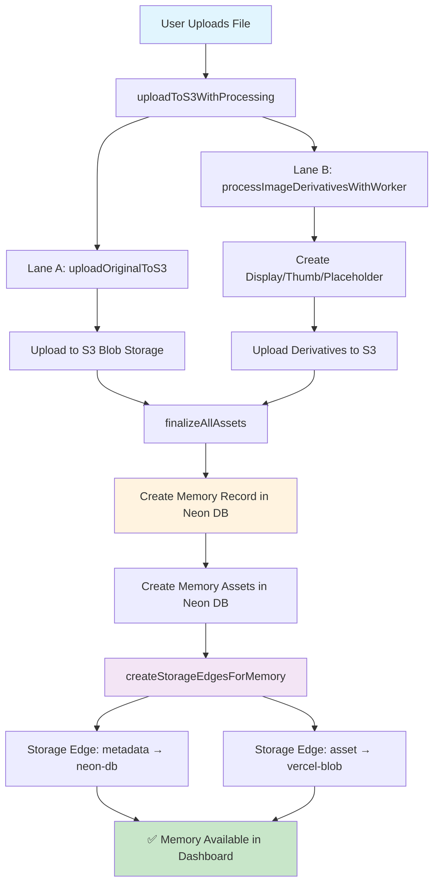
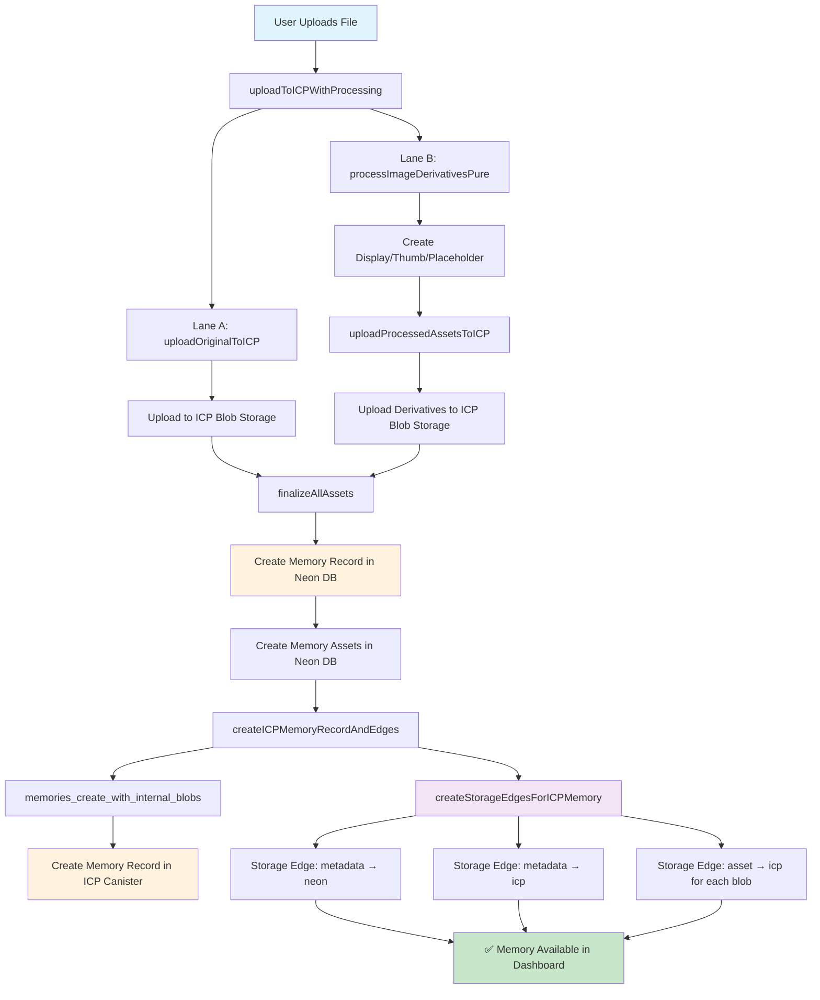

# ICP vs S3 Memory Creation Flow Analysis

**Status**: Open  
**Priority**: High  
**Date**: 2025-10-08  
**Branch**: icp-413-wire-icp-memory-upload-frontend-backend

## Summary

Analysis of the memory creation flow differences between ICP and S3 upload systems, showing the correct implementation for both approaches and highlighting the architectural differences.

## S3 Memory Creation Flow (Current - Working)



### S3 Flow Functions:

- **Entry Point**: `uploadToS3WithProcessing()`
- **Lane A**: `uploadOriginalToS3()` → S3 blob storage
- **Lane B**: `processImageDerivativesWithWorker()` → S3 derivatives
- **Finalization**: `finalizeAllAssets()` → Neon database
- **Storage Tracking**: `createStorageEdgesForMemory()` → Storage edges

## ICP Memory Creation Flow (Fixed Implementation)



### ICP Flow Functions:

- **Entry Point**: `uploadToICPWithProcessing()`
- **Lane A**: `uploadOriginalToICP()` → ICP blob storage
- **Lane B**: `processImageDerivativesPure()` → `uploadProcessedAssetsToICP()` → ICP derivatives
- **Finalization**: `finalizeAllAssets()` → Neon database
- **ICP Memory Creation**: `createICPMemoryRecordAndEdges()` → ICP canister
- **Storage Tracking**: `createStorageEdgesForICPMemory()` → Storage edges

## Key Architectural Differences

### S3 Approach (Single Storage)

```
Neon Database ←→ S3 Blob Storage
     ↑              ↑
Memory Record   Blob Files
```

**Storage Edges Created:**

- `artifact: 'metadata'`, `backend: 'neon-db'`
- `artifact: 'asset'`, `backend: 'vercel-blob'`

### ICP Approach (Dual Storage)

```
Neon Database ←→ ICP Canister
     ↑              ↑
Memory Record   Memory Record + Blob Files
```

**Storage Edges Created:**

- `artifact: 'metadata'`, `locationMetadata: 'neon'`
- `artifact: 'metadata'`, `locationMetadata: 'icp'`
- `artifact: 'asset'`, `locationAsset: 'icp'` (for each blob)

## Implementation Details

### S3 Memory Creation

```typescript
// 1. Upload files to S3
await uploadOriginalToS3(files, grants, onProgress);
await processImageDerivativesWithWorker(file, grant);

// 2. Create memory in Neon database
await finalizeAllAssets(laneAResult, laneBResult);

// 3. Create storage edges
await createStorageEdgesForMemory({
  memoryId,
  memoryType,
  url: blob.url,
  size: file.size,
  contentHash: hash,
});
```

### ICP Memory Creation (Fixed)

```typescript
// 1. Upload files to ICP
await uploadOriginalToICP(files, onProgress);
await uploadProcessedAssetsToICP(processedBlobs, fileName);

// 2. Create memory in Neon database
await finalizeAllAssets(laneAResult, laneBResult);

// 3. Create memory in ICP canister
await createICPMemoryRecordAndEdges(neonMemoryId, blobAssets, memoryMetadata);

// 4. Create storage edges
await createStorageEdgesForICPMemory(neonMemoryId, icpMemoryId, blobAssets);
```

## Storage Edge Records Created

### S3 Flow (2 edges per memory)

```sql
-- Metadata in Neon
INSERT INTO storage_edges (memoryId, artifact, locationMetadata, present)
VALUES ('memory-123', 'metadata', 'neon', true);

-- Asset in Vercel Blob
INSERT INTO storage_edges (memoryId, artifact, locationAsset, present, locationUrl)
VALUES ('memory-123', 'asset', 'vercel_blob', true, 'https://blob.vercel-storage.com/...');
```

### ICP Flow (2 + N edges per memory, where N = number of assets)

```sql
-- Metadata in Neon
INSERT INTO storage_edges (memoryId, artifact, locationMetadata, present)
VALUES ('memory-123', 'metadata', 'neon', true);

-- Metadata in ICP
INSERT INTO storage_edges (memoryId, artifact, locationMetadata, present, locationUrl)
VALUES ('memory-123', 'metadata', 'icp', true, 'icp://memory/mem:capsule:123');

-- Original asset in ICP
INSERT INTO storage_edges (memoryId, artifact, locationAsset, present, locationUrl)
VALUES ('memory-123', 'asset', 'icp', true, 'icp://blob/blob_5535978201241661286');

-- Display asset in ICP
INSERT INTO storage_edges (memoryId, artifact, locationAsset, present, locationUrl)
VALUES ('memory-123', 'asset', 'icp', true, 'icp://blob/blob_9046547090427919786');

-- Thumb asset in ICP
INSERT INTO storage_edges (memoryId, artifact, locationAsset, present, locationUrl)
VALUES ('memory-123', 'asset', 'icp', true, 'icp://blob/blob_12286345354415549334');
```

## Benefits of This Approach

### 1. **Complete Storage Tracking**

- Every piece of data is tracked in storage edges
- Easy to answer "Where is memory X stored?"
- Supports multi-cloud and hybrid storage

### 2. **Dual Storage Support**

- Memory exists in both Neon and ICP
- Dashboard can switch between data sources
- Redundancy and migration capabilities

### 3. **Asset-Level Granularity**

- Each asset (original, display, thumb, placeholder) tracked separately
- Different assets can be stored in different backends
- Fine-grained storage management

### 4. **Consistent Architecture**

- Both S3 and ICP flows use the same storage edge pattern
- Easy to add new storage backends
- Unified storage management system

## Migration Path

### Current State (Broken)

```
ICP Upload → Neon Memory → ❌ Failed Memory Edge Creation
```

### Target State (Fixed)

```
ICP Upload → Neon Memory → ICP Memory → Storage Edges → ✅ Working Dashboard
```

## Testing Strategy

### 1. **Upload Flow Testing**

- [ ] Test single file upload to ICP
- [ ] Test multiple file upload to ICP
- [ ] Test image derivatives creation
- [ ] Test non-image file uploads

### 2. **Storage Edge Testing**

- [ ] Verify storage edges are created correctly
- [ ] Test edge queries and lookups
- [ ] Test edge updates and synchronization

### 3. **Dashboard Integration Testing**

- [ ] Test ICP data source toggle
- [ ] Verify memories appear in dashboard
- [ ] Test memory display and interaction

### 4. **Error Handling Testing**

- [ ] Test partial upload failures
- [ ] Test ICP canister communication errors
- [ ] Test storage edge creation failures

## Conclusion

The fixed ICP implementation now follows the same architectural pattern as the working S3 implementation, with the key difference being dual storage (Neon + ICP) instead of single storage (Neon + S3). This provides complete storage tracking, dual redundancy, and consistent dashboard functionality across both storage backends.

The storage edges system enables:

- **Data Discovery**: "Where is memory X stored?"
- **Multi-Cloud Support**: Assets can be on different backends
- **Migration**: Track what needs to be moved where
- **Cleanup**: Know what to delete from each backend
- **Analytics**: Storage usage per backend
