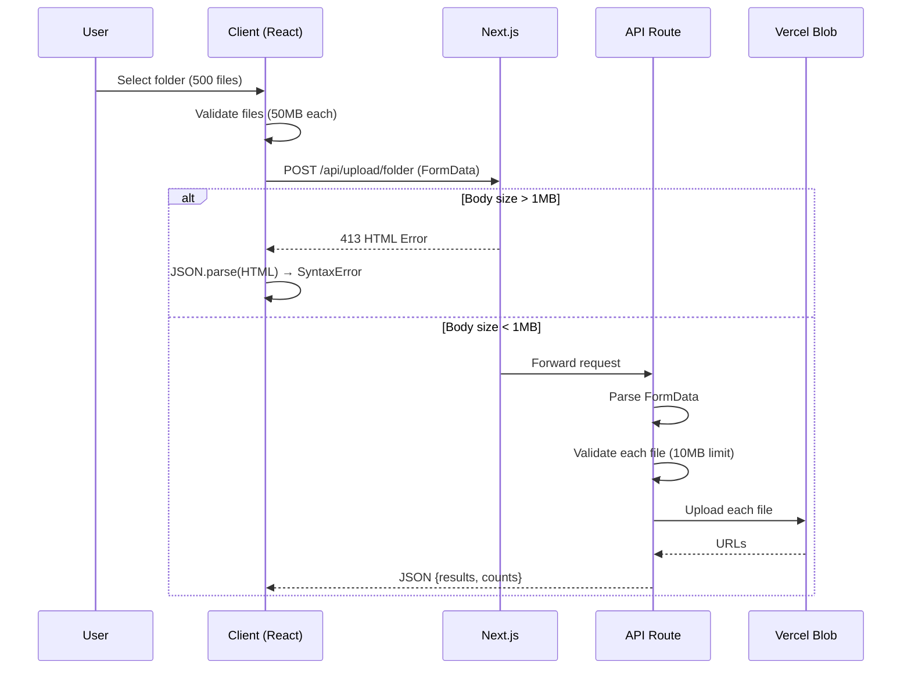

# Overview of Folder Upload Flow (target: 500 files × ~20 MB ≈ 10 GB)

**Labels**: `type:analysis`, `area:uploads`, `priority:high`

## Summary

The current folder upload flow processes multiple files through a single Next.js API route using FormData, with client-side validation (50MB per file) and server-side validation (10MB files, 25MB videos). The system fails at the Next.js body size limit (~1MB default) before reaching application code, causing HTTP 413 errors and JSON parsing failures. The flow uses Vercel Blob for storage with no chunked upload support, making it unsuitable for large folder uploads.

## Goals

- Map all files and functions involved (client + server)
- Show end-to-end flow from selection → storage → response
- Surface current limits (per-file, per-request, total, timeouts)
- Provide minimal code snippets for each critical step

## Files Involved

### Client

- `/src/nextjs/src/hooks/user-file-upload.ts` - Main upload hook with validation
- `/src/nextjs/src/components/memory/item-upload-button.tsx` - Upload UI components
- `/src/nextjs/src/services/upload.ts` - Legacy upload service
- `/src/nextjs/src/services/icp-upload.ts` - ICP canister upload service

### Server

- `/src/nextjs/src/app/api/memories/upload/folder/route.ts` - Main folder upload API
- `/src/nextjs/src/app/api/memories/upload/onboarding/folder/route.ts` - Onboarding folder upload
- `/src/nextjs/src/app/api/memories/upload/utils.ts` - Validation, parsing, storage utilities
- `/src/nextjs/next.config.ts` - Next.js configuration (missing body size limits)

### Shared Utils

- `/src/nextjs/src/db/schema.ts` - Database schema for memory storage
- `/src/nextjs/src/hooks/use-upload-storage.ts` - Upload storage management

## Functions & Snippets

### Client

#### `selectFolder()` - Folder selection and file extraction

```ts
// item-upload-button.tsx:102-109
const handleUploadClick = () => {
  const el = fileInputRef.current;
  if (!el) return;

  if (mode === "folder") {
    el.setAttribute("webkitdirectory", "");
    el.setAttribute("directory", "");
    el.multiple = true;
  }
  el.click();
};
```

#### `validateFiles()` - Client-side validation

```ts
// user-file-upload.ts:111-116
const checkFileSize = (file: File) => {
  if (file.size > 50 * 1024 * 1024) {
    console.error("❌ File too large");
    throw new Error("File too large");
  }
};
```

#### `buildFormData()` - Request construction

```ts
// user-file-upload.ts:298-304
const formData = new FormData();
Array.from(files).forEach((file) => {
  formData.append("file", file);
});

const endpoint = isOnboarding ? "/api/memories/upload/onboarding/folder" : "/api/memories/upload/folder";
const response = await fetch(endpoint, { method: "POST", body: formData });
```

#### `handleError()` - Error handling with JSON/HTML mismatch

```ts
// user-file-upload.ts:349-356
} catch (error) {
  console.error("Folder upload error:", error);
  toast({
    variant: "destructive",
    title: "Upload failed",
    description: error instanceof Error ? error.message : "Please try again.",
  });
  onError?.(error as Error);
}
```

### Server

#### `entry handler` - API route entry point

```ts
// folder/route.ts:141-158
export async function POST(request: NextRequest) {
  const startTime = Date.now();
  console.log("🚀 Starting folder upload process...");

  try {
    // Parse files using the utility function
    const { files, userId: providedAllUserId, error: parseError } = await parseMultipleFiles(request);
    if (parseError) {
      return parseError;
    }

    if (!files || files.length === 0) {
      return NextResponse.json({ error: "No files provided" }, { status: 400 });
    }
```

#### `body parsing` - FormData extraction

```ts
// utils.ts:387-414
export async function parseMultipleFiles(
  request: NextRequest
): Promise<{ files: File[]; userId?: string; error: NextResponse | null }> {
  try {
    const formData = await request.formData();
    const files = formData.getAll("file") as File[];
    const userId = formData.get("userId") as string | null;

    if (!files || files.length === 0) {
      return {
        files: [],
        error: NextResponse.json({ error: "Missing files" }, { status: 400 }),
      };
    }

    return { files, userId: userId || undefined, error: null };
  } catch (error) {
    return {
      files: [],
      error: NextResponse.json({ error: "Invalid form data" }, { status: 400 }),
    };
  }
}
```

#### `storage adapter` - Vercel Blob upload

```ts
// utils.ts:80-90
export async function uploadFileToStorage(file: File, existingBuffer?: Buffer): Promise<string> {
  const buffer = existingBuffer || Buffer.from(await file.arrayBuffer());
  const safeFileName = file.name.replace(/[^a-zA-Z0-9-_\.]/g, "_");

  const { url } = await put(`uploads/${Date.now()}-${safeFileName}`, buffer, {
    access: "public",
    contentType: file.type,
  });

  return url;
}
```

#### `response` - Success/error payload

```ts
// folder/route.ts:133-138
/**
 * Response Format:
 * {
 *   results: Array<{ id: string, ownerId: string, fileName: string }>,
 *   totalFiles: number,
 *   successfulUploads: number,
 *   failedUploads: number
 * }
 */
```

## Configuration & Limits

### Next.js Configuration

```ts
// next.config.ts - MISSING body size configuration
const nextConfig: NextConfig = {
  // ❌ NO bodyParser configuration
  // ❌ NO experimental.bodyParser configuration
  // Current default: ~1MB body size limit
};
```

### Platform Limits

| Component               | Current Limit  | Target (10GB) | Status                 |
| ----------------------- | -------------- | ------------- | ---------------------- |
| Next.js body parser     | ~1MB (default) | 50MB+         | ❌ Not configured      |
| Vercel Function         | 4.5MB request  | 50MB+         | ❌ Too low             |
| Vercel Function timeout | 10s (Hobby)    | 60s+          | ❌ Too short           |
| Vercel Function memory  | 1024MB         | 3008MB        | ⚠️ May be insufficient |

### Client Limits

```ts
// user-file-upload.ts:112
const checkFileSize = (file: File) => {
  if (file.size > 50 * 1024 * 1024) {
    // 50MB per file
    throw new Error("File too large");
  }
};

// user-file-upload.ts:247
if (files.length > 25) {
  // 25 files max
  toast({
    variant: "destructive",
    title: "Too many files",
    description: "Please select a folder with 25 files or fewer.",
  });
  return;
}
```

### Server Limits

```ts
// utils.ts:10-11
export const MAX_FILE_SIZE = 10 * 1024 * 1024; // 10MB files
export const MAX_VIDEO_SIZE = 25 * 1024 * 1024; // 25MB videos
```

### Storage Limits

- **Vercel Blob**: 4.5GB per object, no multipart upload
- **ICP Canister**: Chunked upload support (32KB inline, 64KB chunks, 512 max chunks = ~32MB max)

## End-to-End Flow

1. **User selects folder** → `handleUploadClick()` sets webkitdirectory attribute
2. **Client validates** → `checkFileSize()` enforces 50MB per file, 25 file limit
3. **Client builds request** → `FormData` with all files, POST to `/api/memories/upload/folder`
4. **Next.js intercepts** → Body size check fails at ~1MB (before app code runs)
5. **Server returns 413** → HTML error page instead of JSON
6. **Client tries JSON.parse()** → SyntaxError on HTML content
7. **User sees generic error** → No progress indication, confusing message

## Example Trace (Single File)

### Request

```http
POST /api/memories/upload/folder HTTP/1.1
Content-Type: multipart/form-data; boundary=----WebKitFormBoundary
Content-Length: 2097152

------WebKitFormBoundary
Content-Disposition: form-data; name="file"; filename="large-image.jpg"
Content-Type: image/jpeg

[binary data - 2MB]
------WebKitFormBoundary--
```

### Response (413 Error)

```http
HTTP/1.1 413 Request Entity Too Large
Content-Type: text/html

<!DOCTYPE html>
<html>
<head><title>413 Request Entity Too Large</title></head>
<body>Request Entity Too Large</body>
</html>
```

### Client Error

```javascript
// user-file-upload.ts:312
const json = (await response.json()) as FolderResp; // ❌ Tries to parse HTML as JSON
// Result: SyntaxError: Unexpected token 'R', "Request En"... is not valid JSON
```

## Known Bottlenecks

### Critical Blockers

1. **Next.js body size limit** (~1MB) - Blocks all folder uploads
2. **Vercel Function request limit** (4.5MB) - Insufficient for target
3. **No chunked upload support** - Can't handle large files
4. **Client file count limit** (25 files) - Too low for 500 files

### Performance Issues

1. **Synchronous processing** - All files processed in single request
2. **Memory buffering** - Files loaded entirely into memory
3. **No progress tracking** - Users can't see upload progress
4. **No retry logic** - Failed uploads require full restart

### Error Handling Problems

1. **HTML vs JSON responses** - Server returns HTML errors, client expects JSON
2. **Generic error messages** - No specific guidance for users
3. **No partial success handling** - All-or-nothing approach

## Error Catalog

### Real Error Messages

```javascript
// 413 Payload Too Large
"Failed to load resource: the server responded with a status of 413 ()"

// JSON parsing error
"Folder upload error: SyntaxError: Unexpected token 'R', "Request En"... is not valid JSON"

// File type validation
"Folder upload error: Error: Invalid file type"

// File size validation
"❌ File too large" // Client-side
"File too large" // Server-side
```

### Error Sources

- **Next.js middleware** - 413 errors before app code
- **Client validation** - File type/size checks
- **Server validation** - MIME type validation
- **Storage errors** - Vercel Blob upload failures

## Sample Code Snippets

### Client: Request Creation

```ts
// user-file-upload.ts:298-304
const formData = new FormData();
Array.from(files).forEach((file) => {
  formData.append("file", file);
});

const response = await fetch(endpoint, {
  method: "POST",
  body: formData,
});
```

### Server: Route Handler Entry

```ts
// folder/route.ts:141-158
export async function POST(request: NextRequest) {
  try {
    const { files, error: parseError } = await parseMultipleFiles(request);
    if (parseError) return parseError;

    if (!files || files.length === 0) {
      return NextResponse.json({ error: "No files provided" }, { status: 400 });
    }
```

### Storage: Vercel Blob Upload

```ts
// utils.ts:80-90
export async function uploadFileToStorage(file: File, existingBuffer?: Buffer): Promise<string> {
  const buffer = existingBuffer || Buffer.from(await file.arrayBuffer());
  const { url } = await put(`uploads/${Date.now()}-${safeFileName}`, buffer, {
    access: "public",
    contentType: file.type,
  });
  return url;
}
```

### Error Mapping: Server → JSON

```ts
// folder/route.ts:315-317
if (!response.ok) {
  throw new Error(json?.error || "Folder upload failed");
}
```

## Sequence Diagram



## Telemetry to Capture

### Missing Metrics

- **Client timing**: Selection → request → first byte → complete
- **Per-file progress**: Upload progress for individual files
- **Server logs**: Body size, parse time, memory usage
- **Storage latencies**: Vercel Blob response times
- **Error rates**: 413 vs validation vs storage failures

### Current Logging

```ts
// folder/route.ts:143
console.log("🚀 Starting folder upload process...");

// utils.ts:160
logMultipleFileDetails(files);

// user-file-upload.ts:350
console.error("Folder upload error:", error);
```

## Open Questions

1. **Server-side transforms required?** - Hashing, virus scan, EXIF stripping
2. **Direct-to-storage possible?** - Bypass Functions for large uploads
3. **Required max per-file and total size for GA?** - Current limits too restrictive
4. **Chunked upload implementation?** - Needed for 20MB+ files
5. **Progress tracking strategy?** - Real-time updates for large uploads

## Acceptance Criteria

- [ ] Complete file list (paths) and function inventory ✅
- [ ] Concrete snippets for each critical step ✅
- [ ] Real request/response examples for success and failure ✅
- [ ] Identified limits with code/config locations ✅
- [ ] Clear flow diagram or bullet trace ✅

---

**Environment**: Development  
**Browser**: Chrome/Firefox (based on console logs)  
**Reproduction**: 100% - happens on every folder upload attempt  
**Target**: 500 files × 20MB = 10GB total upload capacity
