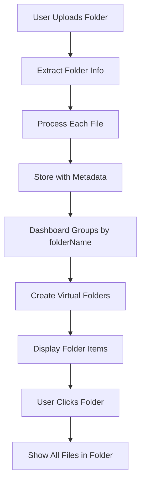

# Folder Upload System Architecture

## Overview

The folder upload system uses a **virtual folder approach** where folders are not stored as separate database entities, but are created dynamically based on metadata in individual file records.

## Architecture

### 1. Virtual Folder System

**Key Concept**: Folders are virtual groupings created from file metadata, not physical database entities.

**Benefits**:

- No separate folder management complexity
- Flexible grouping based on metadata
- Familiar folder-like user experience
- Easy to implement and maintain

### 2. Database Schema

**Evolution from Virtual to Relational**: The system has evolved from a virtual folder approach to a proper relational design.

**File Storage**: Each file is stored individually in separate tables with folder metadata:

#### Old Implementation (Main Branch)

```typescript
// Separate tables: images, videos, documents, notes, audio
// Each with metadata JSON field containing folder info
{
  id: string;
  ownerId: string;
  url: string;
  title: string;
  metadata: {
    folderName?: string;     // For virtual folder grouping
    originalPath?: string;   // Full relative path from upload
    size: number;
    mimeType: string;
    originalName: string;
    uploadedAt: string;
    // ... other metadata
  };
  // ... other fields
}
```

#### New Implementation (Current Branch) - SUPERIOR DESIGN

```typescript
// Unified memories table with proper FK relationships
{
  id: string;
  ownerId: string;
  type: "image" | "video" | "document" | "note" | "audio";
  title: string;
  description: string;
  parentFolderId: string | null; // FK to folders.id
  metadata: {
    originalPath?: string; // Preserved upload path
    custom?: Record<string, unknown>;
  }
  // ... other fields
}

// Dedicated folders table for proper relational design
{
  id: string; // Primary key
  ownerId: string; // FK to allUsers.id
  name: string; // Folder name
  parentFolderId: string | null; // Self-referencing FK for nested folders
  createdAt: timestamp;
  updatedAt: timestamp;
}
```

#### Why the New Schema is Superior

**Relational Integrity:**

- Proper foreign key constraints ensure data consistency
- Cascade deletes work correctly (delete folder → delete all contained memories)
- Database-level referential integrity prevents orphaned records

**Performance Benefits:**

- Indexed foreign keys for fast folder queries
- No need to scan metadata JSON fields for folder grouping
- Efficient joins between folders and memories tables

**Scalability:**

- Supports nested folder hierarchies (folders within folders)
- Easy to add folder-specific metadata (permissions, sharing, etc.)
- Better support for complex folder operations (move, rename, etc.)

**Maintainability:**

- Clear separation of concerns (folders vs. memories)
- Standard relational patterns familiar to developers
- Easier to implement folder-specific features

### 3. Upload Process

#### File Path Extraction

When uploading a folder, the system extracts folder information from file paths:

```typescript
function extractFolderInfo(fileName: string): { originalPath: string; folderName: string } {
  // When using webkitdirectory, fileName contains the full relative path
  // e.g., "Wedding Photos/ceremony/img001.jpg" -> folderName: "Wedding Photos"
  const pathParts = fileName.split("/");
  const folderName = pathParts.length > 1 ? pathParts[0] : "Ungrouped";

  return {
    originalPath: fileName,
    folderName: folderName,
  };
}
```

#### Metadata Storage

Each file is stored with folder metadata:

```typescript
const { folderName, originalPath } = extractFolderInfo(file.name);

const memory = {
  title: file.name.split("/").pop()?.split(".")[0] || "Untitled", // Clean filename
  metadata: {
    folderName: folderName, // "Wedding Photos"
    originalPath: originalPath, // "Wedding Photos/ceremony/img001.jpg"
    uploadedAt: new Date().toISOString(),
    originalName: file.name,
    size: file.size,
    mimeType: file.type,
  },
  // ... other fields
};
```

### 4. Dashboard Display

#### Virtual Folder Creation

The dashboard creates virtual folder items by grouping memories:

```typescript
export const processDashboardItems = (memories: NormalizedMemory[]): DashboardItem[] => {
  // Step 1: Group memories by folderName
  const folderGroups = memories.reduce((groups, memory) => {
    const folderName = memory.metadata?.folderName;
    if (folderName) {
      if (!groups[folderName]) {
        groups[folderName] = [];
      }
      groups[folderName].push(memory);
    }
    return groups;
  }, {} as Record<string, NormalizedMemory[]>);

  // Step 2: Create FolderItems for each group
  const folderItems: FolderItem[] = Object.entries(folderGroups).map(([folderName, folderMemories]) => ({
    id: `folder-${folderName}`,
    type: "folder" as const,
    title: folderName,
    description: `${folderMemories.length} items`,
    itemCount: folderMemories.length,
    memories: folderMemories,
    createdAt: folderMemories[0]?.createdAt,
    updatedAt: folderMemories[0]?.updatedAt,
  }));

  return [...folderItems, ...individualMemories];
};
```

#### Folder Representation

Folders appear as special dashboard items:

```typescript
interface FolderItem {
  id: string; // "folder-Wedding Photos"
  type: "folder";
  title: string; // "Wedding Photos"
  description: string; // "5 items"
  itemCount: number; // 5
  memories: NormalizedMemory[]; // All files in this folder
  createdAt: string;
  updatedAt: string;
}
```

### 5. Navigation

#### Folder Page

When clicking a folder, users navigate to `/dashboard/folder/${folderName}`:

```typescript
// Folder page fetches all memories with matching folderName
const folderMemories = await getMemoriesByFolder(folderName);

// Display all files that belong to this virtual folder
```

#### URL Structure

- Dashboard: `/dashboard` - Shows folders and individual files
- Folder: `/dashboard/folder/Wedding Photos` - Shows all files in "Wedding Photos" folder
- Individual file: `/dashboard/memory-id` - Shows specific file

### 6. Data Flow



### 7. Implementation Requirements

#### Upload Handler

The folder upload handler must:

1. **Extract folder information** from file paths
2. **Clean file names** (remove folder prefix)
3. **Add folder metadata** to each file
4. **Store files individually** with proper metadata

```typescript
// Required implementation
const { folderName, originalPath } = extractFolderInfo(file.name);

await storeInNewDatabase({
  type: memoryType,
  ownerId: allUserId,
  url,
  file: {
    ...file,
    name: file.name.split("/").pop() || file.name, // Clean filename
  },
  metadata: {
    folderName: folderName, // ✅ Required for virtual folders
    originalPath: originalPath, // ✅ Required for path tracking
    uploadedAt: new Date().toISOString(),
    originalName: file.name,
    size: file.size,
    mimeType: file.type,
  },
});
```

#### Dashboard Processing

The dashboard must:

1. **Group memories** by `metadata.folderName`
2. **Create virtual folder items** for each group
3. **Display folder count** and navigation
4. **Handle folder clicks** to show contents

### 8. Benefits of This Approach

**Simplicity**:

- No complex folder management
- No folder hierarchy maintenance
- No folder sharing complexity

**Flexibility**:

- Easy to change grouping logic
- Can support multiple grouping criteria
- Simple to implement and debug

**Performance**:

- No additional database queries for folders
- Efficient grouping at display time
- Minimal storage overhead

**User Experience**:

- Familiar folder-like interface
- Easy navigation and organization
- Clear visual hierarchy

### 9. Limitations

**No Nested Folders**: The current system only supports single-level folder grouping.

**No Folder Metadata**: Folders don't have their own metadata (creation date, description, etc.).

**No Folder Operations**: Can't rename, move, or delete folders as entities.

**Path Dependency**: Folder grouping depends on the original upload path structure.

### 10. Future Enhancements

**Hierarchical Folders**: Could extend to support nested folder structures using `parentFolderId`.

**Folder Metadata**: Could add folder-specific metadata and operations.

**Dynamic Grouping**: Could support multiple grouping criteria (date, type, tags, etc.).

**Folder Management**: Could add folder rename, move, and delete operations.

## Conclusion

The virtual folder system provides a clean, efficient way to organize uploaded files without the complexity of a traditional folder management system. It's particularly well-suited for file upload scenarios where users want to maintain the organization from their local file system.
