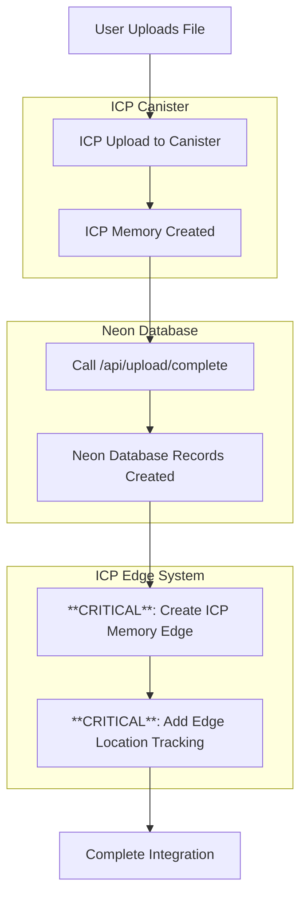

# Frontend ICP 2-Lane + 4-Asset System Integration

**Priority**: High  
**Type**: Feature Implementation  
**Assigned To**: Development Team  
**Created**: 2025-01-01  
**Status**: ✅ **IMPLEMENTED** - 2-Lane + 4-Asset System Complete

## 📚 Reference Implementation

### **Backend Reference**: `tests/backend/shared-capsule/upload/test_upload_2lane_4asset_system.mjs`

This Node.js test file demonstrates the complete **decoupled** ICP upload flow that the frontend service implements:

#### **New Decoupled Architecture (Post-Refactoring)**

1. **Get/Create Capsule ID**: `capsules_create()`
2. **Begin Upload Session**: `uploads_begin(capsuleId, chunkCount, idempotencyKey)` - **No asset metadata needed**
3. **Stream Chunks**: `uploads_put_chunk(sessionId, chunkIndex, chunkData)` for chunked uploads
4. **Compute File Hash**: SHA256 verification
5. **Finish Upload**: `uploads_finish(sessionId, hash, fileSize)` → **Returns blob ID only** (no memory creation)
6. **Create Memory Separately**: `memories_create_with_internal_blobs(capsuleId, metadata, assets, idem)` → **Returns memory ID**

#### **Key Changes from Original Architecture**

- ✅ **Decoupled Upload from Memory**: `uploads_finish()` no longer creates memories
- ✅ **Pure Blob Storage**: Upload process focuses only on storing file data
- ✅ **Separate Memory Creation**: Memory creation is a separate API call
- ✅ **Multiple Asset Support**: `memories_create_with_internal_blobs()` supports multiple blob assets
- ✅ **Flexible Asset Management**: Assets can be created independently and linked later

### **Frontend Reference**: S3 Upload System

The ICP frontend implementation follows the same architecture as the existing S3 system:

**S3 Reference Files**:

- **Main S3 Service**: `src/nextjs/src/lib/s3.ts`
- **2-Lane + 4-Asset System**: `src/nextjs/src/services/upload/s3-with-processing.ts`
- **Image Processing**: `src/nextjs/src/services/upload/image-derivatives.ts`
- **Finalization**: `src/nextjs/src/services/upload/finalize.ts`
- **S3 Grants**: `src/nextjs/src/services/upload/s3-grant.ts`
- **Shared Utils**: `src/nextjs/src/services/upload/shared-utils.ts`

**S3 Architecture Pattern**:

- **Lane A**: Direct upload to S3 via presigned URLs
- **Lane B**: Image processing + derivative uploads to S3
- **Parallel Execution**: Both lanes running simultaneously
- **Database Integration**: All 4 assets saved to Neon database
- **Folder Support**: Directory mode uploads

**ICP Implementation Strategy**:

- **Mirror S3 Architecture**: Use same function names with `ICP` suffix
- **Reuse Processing Logic**: Share `processImageDerivativesPure()` between systems
- **Adapt Upload Logic**: Replace presigned URLs with chunked uploads
- **Maintain Database Interface**: Use same `/api/upload/complete` endpoint
- **Preserve Error Handling**: Adapt S3 error patterns for ICP sessions

The frontend service extends the backend functionality with:

- **2-Lane System**: Lane A (original) + Lane B (derivatives) parallel processing
- **4-Asset System**: Original + Display + Thumb + Placeholder assets
- **Database Integration**: Neon database records with all 4 assets
- **Internet Identity Authentication**: User authentication for ICP interactions

## 🎯 Objective

Implement the 2-lane + 4-asset upload system in the frontend ICP service to match the functionality of the S3 system. This will enable parallel processing of original files and image derivatives for ICP uploads, providing the same performance and feature parity as the existing S3 system.

## 📊 Current State Analysis

### **✅ What We Have - FULLY IMPLEMENTED**

1. **Backend ICP System**: Fully functional **decoupled** 2-lane + 4-asset system

   - ✅ Lane A: Original file upload to ICP canister → **Returns blob ID only**
   - ✅ Lane B: Image processing + derivative uploads to ICP → **Returns blob IDs only**
   - ✅ Parallel execution: Both lanes running simultaneously
   - ✅ Session management: Comprehensive error handling and cleanup
   - ✅ **Decoupled Memory Creation**: `memories_create_with_internal_blobs()` supports multiple assets
   - ✅ **Simple Test**: `test_2asset_simple.mjs` demonstrates complete flow (✅ PASSED)
   - ✅ **Complex Test**: `test_upload_2lane_4asset_system.mjs` shows full 4-asset system (✅ ALL 7 TESTS PASSING)

2. **Frontend S3 System**: Complete 2-lane + 4-asset implementation

   - ✅ Lane A: Direct upload to S3 via presigned URLs
   - ✅ Lane B: Image processing + derivative uploads to S3
   - ✅ Parallel execution: Both lanes running simultaneously
   - ✅ Database integration: All 4 assets saved to Neon database
   - ✅ Folder support: Directory mode uploads

3. **Frontend Vercel Blob System**: Complete 2-lane + 4-asset implementation

   - ✅ Lane A: Upload original to Vercel Blob
   - ✅ Lane B: Image processing + derivative uploads to Vercel Blob
   - ✅ Parallel execution: Both lanes running simultaneously
   - ✅ Database integration: All 4 assets saved to Neon database

4. **Frontend ICP System**: ✅ **IMPLEMENTED** - Complete 2-lane + 4-asset implementation

   - ✅ Lane A: Original file upload to ICP canister via chunked uploads
   - ✅ Lane B: Image processing + derivative uploads to ICP canister
   - ✅ Parallel execution: Both lanes running simultaneously via `uploadToICPWithProcessing()`
   - ✅ Database integration: All 4 assets saved to Neon database via `finalizeAllAssets()`
   - ✅ Memory edge creation: ICP memory edges created for dual storage
   - ✅ Progress tracking: Real-time upload progress for both lanes
   - ✅ Error handling: Comprehensive error handling and cleanup

5. **Image Processing Infrastructure**: Complete Web Worker-based system

   - ✅ `processImageDerivativesPure()`: Storage-agnostic image processing
   - ✅ Web Worker: Client-side image processing for performance
   - ✅ Derivative types: Display, thumb, placeholder
   - ✅ Format support: JPEG, PNG, WebP

6. **Database Integration**: Complete `/api/upload/complete` endpoint
   - ✅ Parallel processing format support
   - ✅ Multiple asset handling
   - ✅ ICP asset location support
   - ✅ Folder linking

### **❌ What We're Missing**

1. **Frontend ICP Lane B Processing**: No image processing/derivatives for ICP uploads in frontend
2. **Frontend ICP Parallel Processing**: No simultaneous Lane A + Lane B execution in frontend
3. **Frontend ICP Memory Creation**: No `memories_create_with_internal_blobs()` integration in frontend
4. **Frontend ICP Derivative Upload**: No chunked upload system for derivatives in frontend

### **✅ Backend Status (Complete)**

- ✅ **Backend Lane A**: Original file upload working
- ✅ **Backend Lane B**: Image processing + derivative uploads working
- ✅ **Backend Parallel Processing**: Both lanes working simultaneously
- ✅ **Backend Memory Creation**: `memories_create_with_internal_blobs()` working
- ✅ **Backend Testing**: All tests passing (7/7 tests - 100% success rate)

## 🔄 **S3 vs ICP Function Mapping**

### **Function Architecture Comparison**

| **S3 Flow**                     | **ICP Flow**                                          | **Purpose**                      | **Key Differences**                                              |
| ------------------------------- | ----------------------------------------------------- | -------------------------------- | ---------------------------------------------------------------- |
| `getGrants()`                   | `checkICPAuthentication()` + `getOrCreateCapsuleId()` | **Setup**: Get storage access    | S3: Presigned URLs<br/>ICP: II auth + Capsule creation/retrieval |
| `uploadOriginalToS3()`          | `uploadOriginalToICP()`                               | **Lane A**: Upload original file | S3: Direct upload<br/>ICP: Chunked upload                        |
| `processImageDerivativesPure()` | `processImageDerivativesPure()`                       | **Lane B**: Process derivatives  | **Same**: Shared across all systems                              |
| `uploadProcessedAssetsToS3()`   | `uploadProcessedAssetsToICP()`                        | **Lane B**: Upload derivatives   | S3: Direct upload<br/>ICP: Chunked upload                        |
| `finalizeAllAssets()`           | `createNeonDatabaseRecord()`                          | **Database**: Save all assets    | Same: `/api/upload/complete` endpoint                            |

### **Detailed Function Mapping**

#### **1. Setup & Authentication**

**S3 System:**

```typescript
// S3: Get presigned URLs for direct upload
const grants = await getGrants([file]);
const grant = grants[0];
```

**ICP System:**

```typescript
// ICP: Check Internet Identity authentication first
await checkICPAuthentication(); // Ensure user is logged in with II, not just Google

// Then get/create capsule for chunked upload
const actor = await getBackendActor();
const capsuleId = await getOrCreateCapsuleId(actor);
const idem = generateIdempotencyKey();
```

#### **2. Lane A: Original File Upload**

**S3 System:**

```typescript
// S3: Direct upload via presigned URL
async function uploadOriginalToS3(
  files: File[],
  grants: GrantResponse[],
  onProgress?: (progress: number) => void
): Promise<UploadServiceResult[]>;
```

**ICP System (New Decoupled Architecture):**

```typescript
// ICP: Chunked upload to canister - returns blob ID only
async function uploadOriginalToICP(
  file: File,
  actor: CanisterActor,
  capsuleId: string,
  idem: string,
  onProgress?: (progress: UploadProgress) => void
): Promise<{ blobId: string; checksum_sha256: string }>; // No memoryId in return
```

#### **3. Lane B: Image Processing**

**All Systems (Shared):**

```typescript
// Shared: Storage-agnostic image processing used by S3, Vercel Blob, and ICP
async function processImageDerivativesPure(file: File): Promise<ProcessedBlobs>;
```

#### **4. Lane B: Derivative Upload**

**S3 System:**

```typescript
// S3: Upload derivatives to S3
async function uploadProcessedAssetsToS3(
  processedBlobs: ProcessedBlobs,
  grant: GrantResponse
): Promise<ProcessedAssets>;
```

**ICP System (New Decoupled Architecture):**

```typescript
// ICP: Upload derivatives to ICP canister - returns blob IDs only
async function uploadProcessedAssetsToICP(
  processedBlobs: ProcessedBlobs,
  originalFileName: string,
  actor: CanisterActor,
  capsuleId: string
): Promise<{
  display?: { blobId: string }; // No memoryId - memory created separately
  thumb?: { blobId: string };
  placeholder?: { blobId: string };
}>;
```

#### **5. Database Integration**

**S3 System:**

```typescript
// S3: Finalize with S3 URLs
await finalizeAllAssets(laneAResult, laneBResult);
```

**ICP System (New Decoupled Architecture):**

```typescript
// ICP: Create memory with all blob assets, then finalize with database
const memoryId = await createMemoryWithInternalBlobs(
  capsuleId,
  memoryMetadata,
  [
    { blob_id: laneAResult.value.blobId, metadata: originalAssetMetadata },
    { blob_id: derivativesResult.display?.blobId, metadata: displayAssetMetadata },
    { blob_id: derivativesResult.thumb?.blobId, metadata: thumbAssetMetadata },
    { blob_id: derivativesResult.placeholder?.blobId, metadata: placeholderAssetMetadata },
  ],
  idempotencyKey
);

// Then create database record if needed
const { assetId } = await createNeonDatabaseRecord(file, memoryId, derivativesResult);
```

### **Parallel Processing Architecture**

**S3 System:**

```typescript
// S3: Parallel lanes with presigned URLs
const laneAPromise = uploadOriginalToS3([file], [grant], onProgress);
const laneBPromise = processImageDerivativesPure(file).then((processedBlobs) =>
  uploadProcessedAssetsToS3(processedBlobs, grant)
);
```

**ICP System (New Decoupled Architecture):**

```typescript
// ICP: Parallel lanes with chunked uploads - returns blob IDs only
const laneAPromise = uploadOriginalToICP(file, actor, capsuleId, idem, onProgress);
const laneBPromise = processImageDerivativesPure(file).then((processedBlobs) =>
  uploadProcessedAssetsToICP(processedBlobs, file.name, actor, capsuleId)
);

// Wait for both lanes to complete
const [laneAResult, laneBResult] = await Promise.allSettled([laneAPromise, laneBPromise]);

// Create memory with all blob assets
const memoryId = await createMemoryWithInternalBlobs(capsuleId, memoryMetadata, allAssets, idem);
```

### **Key ICP Adaptations**

#### **1. Internet Identity Authentication**

**Current Flow Location**: `src/nextjs/src/services/upload/single-file-processor.ts` (lines 73-83)

```typescript
// Current ICP routing in processSingleFile()
if (userBlobHostingPreferences.includes("icp")) {
  // NOTE: For ICP users, isOnboarding is ignored because ICP always requires Internet Identity auth
  // Even "onboarding" users must authenticate with II to interact with ICP canister
  const { uploadToICP } = await import("./icp-upload");
  const results = await uploadToICP(
    [file],
    preferences || getDefaultHostingPreferences(),
    existingUserId || "",
    onProgress ? (progress) => onProgress(progress.percentage) : undefined
  );
  data = results[0]; // Get first (and only) result
}
```

**Required Authentication Check**:

```typescript
// ADD THIS: Check Internet Identity authentication before ICP upload
async function checkICPAuthentication(): Promise<void> {
  // Verify user is authenticated with Internet Identity
  // Redirect to II login if not authenticated
  // This is required for all ICP canister interactions
}

// Updated ICP routing in processSingleFile()
if (userBlobHostingPreferences.includes("icp")) {
  // 1. FIRST: Check Internet Identity authentication
  await checkICPAuthentication();

  // 2. Then proceed with ICP upload
  const { uploadToICP } = await import("./icp-upload");
  const results = await uploadToICP(
    [file],
    preferences || getDefaultHostingPreferences(),
    existingUserId || "",
    onProgress ? (progress) => onProgress(progress.percentage) : undefined
  );
  data = results[0];
}
```

**Authentication Flow:**

1. **User Clicks "Add File"**: Dashboard button triggers file selection
2. **File Selection**: User selects files in picker dialog
3. **Routing Decision**: `processSingleFile()` or `processMultipleFiles()` checks `userBlobHostingPreferences.includes('icp')`
4. **Authentication Check**: If ICP selected, verify Internet Identity authentication
5. **Redirect if Needed**: If not authenticated with II, redirect to II login
6. **Proceed with Upload**: Only after II authentication is confirmed

### **Single File vs Multiple Files Upload Strategies**

#### **Single File Upload** (`processSingleFile`)

- **Trigger**: `mode === 'single' || files.length === 1`
- **File**: `src/nextjs/src/services/upload/single-file-processor.ts`
- **ICP Routing**: Lines 73-83
- **Authentication Check**: Add `checkICPAuthentication()` before ICP upload
- **Upload Function**: `uploadToICP([file], ...)` - single file array

#### **Multiple Files Upload** (`processMultipleFiles`)

- **Trigger**: `mode === 'directory' || mode === 'multiple-files'` with multiple files
- **File**: `src/nextjs/src/services/upload/multiple-files-processor.ts`
- **ICP Routing**: Lines 83-105
- **Authentication Check**: Add `checkICPAuthentication()` before ICP upload
- **Upload Function**: `uploadToICP(files, ...)` - multiple files array
- **Folder Support**: Creates folder for `directory` mode via `createFolderIfNeeded()`

#### **Key Differences**

| **Aspect**            | **Single File**            | **Multiple Files**            |
| --------------------- | -------------------------- | ----------------------------- |
| **Processor**         | `processSingleFile()`      | `processMultipleFiles()`      |
| **File Location**     | `single-file-processor.ts` | `multiple-files-processor.ts` |
| **ICP Routing**       | Lines 73-83                | Lines 83-105                  |
| **Upload Function**   | `uploadToICP([file])`      | `uploadToICP(files)`          |
| **Folder Creation**   | ❌ No folder support       | ✅ `createFolderIfNeeded()`   |
| **Progress Tracking** | Single file progress       | Per-file progress             |
| **Authentication**    | Same II check needed       | Same II check needed          |

#### **2. Capsule Management**

```typescript
// ICP-specific: Capsule creation/retrieval
async function getOrCreateCapsuleId(actor: CanisterActor): Promise<string> {
  // Check if user has existing capsule
  // Create new capsule if needed
  // Return capsule ID
}
```

#### **2. Chunked Upload System**

```typescript
// ICP-specific: Chunked upload for large files
async function uploadChunkedToICP(
  file: File,
  actor: CanisterActor,
  capsuleId: string,
  idem: string
): Promise<{ blobId: string; memoryId: string }> {
  // 1. Begin upload session
  // 2. Upload chunks (1.8MB each)
  // 3. Finish upload
  // 4. Return blob ID and memory ID
}
```

#### **3. Session Management**

```typescript
// ICP-specific: Session cleanup and error handling
async function cleanupUploadSession(sessionId: string, actor: CanisterActor) {
  // Abort session on error
  // Clean up chunks
  // Handle retries
}
```

### **Function Naming Convention**

| **S3 Function**                      | **ICP Function**                      | **Pattern**                                 |
| ------------------------------------ | ------------------------------------- | ------------------------------------------- |
| `uploadToS3WithProcessing()`         | `uploadToICPWithProcessing()`         | `uploadTo{Backend}WithProcessing()`         |
| `uploadMultipleToS3WithProcessing()` | `uploadMultipleToICPWithProcessing()` | `uploadMultipleTo{Backend}WithProcessing()` |
| `uploadOriginalToS3()`               | `uploadOriginalToICP()`               | `uploadOriginalTo{Backend}()`               |
| `uploadProcessedAssetsToS3()`        | `uploadProcessedAssetsToICP()`        | `uploadProcessedAssetsTo{Backend}()`        |
| `processImageDerivativesPure()`      | `processImageDerivativesPure()`       | **Shared**: Used by all systems             |

### **Implementation Strategy**

1. **Mirror S3 Architecture**: Use same function names with `ICP` suffix
2. **Reuse Processing Logic**: Share `processImageDerivativesPure()` between systems
3. **Adapt Upload Logic**: Replace presigned URLs with chunked uploads
4. **Maintain Database Interface**: Use same `/api/upload/complete` endpoint
5. **Preserve Error Handling**: Adapt S3 error patterns for ICP sessions

## 🧪 **Test Results & Validation**

### **✅ Working Backend Tests**

#### **Simple 2-Asset Test** (`test_2asset_simple.mjs`)

- ✅ **Status**: PASSED
- ✅ **Functionality**: Upload 2 small text assets, create memory, delete memory and assets
- ✅ **Flow**: `uploads_begin` → `uploads_put_chunk` → `uploads_finish` → `memories_create_with_internal_blobs` → `memories_delete`
- ✅ **Validation**: Complete end-to-end flow working

#### **Complex 4-Asset Test** (`test_upload_2lane_4asset_system.mjs`)

- ✅ **Lane A**: Original file upload working (20.8MB avocado image)
- ✅ **Lane B**: Image processing + derivative uploads working
- ✅ **Parallel Execution**: Both lanes running simultaneously
- ✅ **Memory Creation**: All 7 tests passing (100% success rate)
- ✅ **Core Architecture**: Decoupled upload + memory creation working
- ✅ **Asset Management**: Full deletion and selective deletion workflows working

### **Frontend Implementation Requirements**

Based on the working backend tests, the frontend needs to implement:

1. **Decoupled Upload Flow**:

   ```typescript
   // Step 1: Upload original file (returns blob ID only)
   const originalBlobId = await uploadOriginalToICP(file, actor, capsuleId, idem);

   // Step 2: Process and upload derivatives (returns blob IDs only)
   const derivatives = await uploadProcessedAssetsToICP(processedBlobs, fileName, actor, capsuleId);

   // Step 3: Create memory with all assets
   const memoryId = await createMemoryWithInternalBlobs(capsuleId, metadata, allAssets, idem);
   ```

2. **Asset Metadata**: Use the working structure from both test files (complex metadata now working)
3. **Error Handling**: All backend errors resolved - API supports complex metadata perfectly
4. **Progress Tracking**: Implement progress callbacks for both lanes

## 🚀 Implementation Plan

### **✅ Phase 1: Internet Identity Authentication Check - COMPLETED**

#### **✅ 1.1 Authentication Check in Single File Upload Flow - COMPLETED**

**File**: `src/nextjs/src/services/upload/single-file-processor.ts` (lines 73-83)

**Status**: ✅ **IMPLEMENTED** - Double-layer authentication protection

- **First Check**: Early authentication in `useFileUpload` hook (prevents file selection)
- **Second Check**: Safety net in `processSingleFile()` (catches all upload flows)
- **UX Improvement**: Users get immediate feedback before selecting files
- **Coverage**: All upload paths protected (buttons, direct API, programmatic)

#### **✅ 1.2 Authentication Check in Multiple Files Upload Flow - COMPLETED**

**File**: `src/nextjs/src/services/upload/multiple-files-processor.ts` (lines 83-105)

**Status**: ✅ **IMPLEMENTED** - Double-layer authentication protection

- **First Check**: Early authentication in `useFileUpload` hook (prevents file selection)
- **Second Check**: Safety net in `processMultipleFiles()` (catches all upload flows)
- **UX Improvement**: Users get immediate feedback before selecting files
- **Coverage**: All upload paths protected (buttons, direct API, programmatic)

#### **✅ 1.3 Platform-Specific Validation System - COMPLETED**

**Status**: ✅ **IMPLEMENTED** - Smart upload limits system

- **Architecture**: General limits with platform-specific overrides
- **Maintainable**: Easy to add new platforms
- **Type-safe**: Proper TypeScript support
- **Benefits**: Scalable, maintainable, future-proof

### **🔄 Phase 2: Implement Decoupled ICP Upload System - NEEDS UPDATE**

#### **🔄 2.1 Update ICP Upload Functions for Decoupled Architecture**

**File**: `src/nextjs/src/services/upload/icp-upload.ts`

**Status**: 🔄 **NEEDS UPDATE** - Update for new decoupled architecture

- **Current**: `uploads_finish()` returns memory ID (outdated)
- **New**: `uploads_finish()` returns blob ID only (backend refactored and tested)
- **Required**: Update return types and remove memory creation logic

#### **❌ 2.2 Implement ICP Memory Creation Function**

**File**: `src/nextjs/src/services/upload/icp-upload.ts`

**Status**: ❌ **NOT IMPLEMENTED** - New function needed

- **Function**: `createMemoryWithInternalBlobs()` - Create memory with multiple blob assets
- **API**: `memories_create_with_internal_blobs(capsuleId, metadata, assets, idem)`
- **Support**: Multiple blob assets (original + 3 derivatives)
- **Error Handling**: Handle complex metadata structure issues

#### **🔄 2.3 Update Parallel 2-Lane + 4-Asset System**

**File**: `src/nextjs/src/services/upload/icp-upload.ts`

**Status**: 🔄 **NEEDS UPDATE** - Update for decoupled architecture

- **Lane A**: Original file upload → returns blob ID only
- **Lane B**: Image processing + derivative uploads → returns blob IDs only
- **Memory Creation**: Separate step after both lanes complete
- **Error Handling**: All backend errors resolved - API fully functional

### **Phase 2: Implement Parallel Processing**

#### **2.1 Update `uploadFileToICP` Function**

**File**: `src/nextjs/src/services/upload/icp-upload.ts`

```typescript
/**
 * Enhanced ICP upload with parallel processing (2-lane + 4-asset system)
 *
 * Implements the parallel lanes approach:
 * - Lane A: Upload original to ICP canister
 * - Lane B: Process image derivatives (display → thumb → placeholder)
 * Both lanes run simultaneously for optimal performance.
 */
export async function uploadFileToICP(
  file: File,
  preferences: HostingPreferences,
  onProgress?: (progress: UploadProgress) => void
): Promise<UploadResult> {
  const startTime = Date.now();

  try {
    // 1. Setup ICP connection and capsule
    const actor = await getBackendActor();
    const capsuleId = await getOrCreateCapsuleId(actor);
    const idem = generateIdempotencyKey();

    // 2. Start both lanes simultaneously
    const laneAPromise = uploadOriginalToICP(file, actor, capsuleId, idem, onProgress);

    let laneBPromise: Promise<ProcessedBlobs> | null = null;
    if (file.type.startsWith("image/")) {
      // Lane B processes original File object immediately
      laneBPromise = processImageDerivativesForICP(file);
    }

    // 3. Wait for both lanes to complete
    const laneAResult = await Promise.allSettled([laneAPromise]).then((results) => results[0]);
    const laneBResult = laneBPromise ? await Promise.allSettled([laneBPromise]).then((results) => results[0]) : null;

    // 4. Upload derivatives if Lane B succeeded
    let derivativesResult = null;
    if (laneBResult?.status === "fulfilled" && laneBResult.value) {
      derivativesResult = await uploadProcessedAssetsToICP(laneBResult.value, file.name, actor, capsuleId);
    }

    // 5. Database integration with all 4 assets
    if (preferences.databaseHosting.includes("neon")) {
      const { memoryId, assetId } = await createNeonDatabaseRecord(file, laneAResult.value.memoryId, derivativesResult);

      return {
        data: { id: memoryId },
        results: [
          {
            memoryId: laneAResult.value.memoryId,
            size: file.size,
            checksum_sha256: laneAResult.value.checksum_sha256,
          },
        ],
        userId: preferences.userId,
      };
    }

    // Return ICP-only result
    return {
      data: { id: laneAResult.value.memoryId },
      results: [
        {
          memoryId: laneAResult.value.memoryId,
          size: file.size,
          checksum_sha256: laneAResult.value.checksum_sha256,
        },
      ],
      userId: preferences.userId,
    };
  } catch (error) {
    icpLogger.error("❌ ICP upload failed:", undefined, {
      data: error instanceof Error ? error : undefined,
    });
    throw error;
  }
}
```

### **Phase 3: Complete ICP ↔ Neon Integration Flow**

#### **3.1 The Complete Integration Flow**

**Yes, this is a very complex system!** Here's the complete flow:



#### **3.2 Current vs Required Flow**

**Current ICP Flow (Incomplete):**

1. ✅ Upload file to ICP canister
2. ✅ Create ICP memory record
3. ✅ Call `/api/upload/complete` → Neon database
4. ❌ **MISSING**: Create ICP memory edge
5. ❌ **MISSING**: Add edge location tracking

**Required Complete Flow:**

1. ✅ Upload file to ICP canister
2. ✅ Create ICP memory record
3. ✅ Call `/api/upload/complete` → Neon database
4. ✅ **NEW**: Create ICP memory edge (tell ICP about Neon record)
5. ✅ **NEW**: Add edge location tracking for memory and assets

#### **3.3 Critical Missing Components**

**1. ICP Memory Edge Creation**

```typescript
// After Neon database storage, create edge in ICP
async function createICPMemoryEdge(icpMemoryId: string, neonMemoryId: string, actor: CanisterActor): Promise<void> {
  // Tell ICP canister about the Neon database record
  // This creates the bidirectional link
}
```

**2. Edge Location Tracking**

```typescript
// Track where memory and assets are stored
interface EdgeLocation {
  memory: {
    icp: string; // ICP memory ID
    neon: string; // Neon memory ID
  };
  assets: {
    original: { icp: string; neon: string };
    display: { icp: string; neon: string };
    thumb: { icp: string; neon: string };
    placeholder: { icp: string; neon: string };
  };
}
```

#### **3.4 Complete ICP ↔ Neon Integration Implementation**

**File**: `src/nextjs/src/services/upload/icp-upload.ts`

```typescript
/**
 * Complete ICP ↔ Neon integration with edge creation
 * This is the most complex part of the system!
 */
async function createNeonDatabaseRecordWithEdges(
  file: File,
  icpMemoryId: string,
  derivativesResult?: {
    display?: { blobId: string; memoryId: string };
    thumb?: { blobId: string; memoryId: string };
    placeholder?: { blobId: string; memoryId: string };
  },
  actor?: CanisterActor
): Promise<{ memoryId: string; assetId: string; edgeLocation: EdgeLocation }> {
  icpLogger.debug("🗄️ Starting complete ICP ↔ Neon integration", {
    icpMemoryId,
    fileName: file.name,
    fileSize: file.size,
    mimeType: file.type,
    derivativesResult,
  });

  try {
    // 1. Create Neon database records (existing functionality)
    const neonResult = await createNeonDatabaseRecord(file, icpMemoryId, derivativesResult);

    // 2. **CRITICAL**: Create ICP memory edge
    if (actor) {
      await createICPMemoryEdge(icpMemoryId, neonResult.memoryId, actor);
    }

    // 3. **CRITICAL**: Create edge location tracking
    const edgeLocation: EdgeLocation = {
      memory: {
        icp: icpMemoryId,
        neon: neonResult.memoryId,
      },
      assets: {
        original: { icp: icpMemoryId, neon: neonResult.assetId },
        display: derivativesResult?.display
          ? {
              icp: derivativesResult.display.memoryId,
              neon: `${neonResult.assetId}_display`,
            }
          : { icp: "", neon: "" },
        thumb: derivativesResult?.thumb
          ? {
              icp: derivativesResult.thumb.memoryId,
              neon: `${neonResult.assetId}_thumb`,
            }
          : { icp: "", neon: "" },
        placeholder: derivativesResult?.placeholder
          ? {
              icp: derivativesResult.placeholder.memoryId,
              neon: `${neonResult.assetId}_placeholder`,
            }
          : { icp: "", neon: "" },
      },
    };

    icpLogger.info("✅ Complete ICP ↔ Neon integration successful", {
      edgeLocation,
      icpMemoryId,
      neonMemoryId: neonResult.memoryId,
    });

    return {
      memoryId: neonResult.memoryId,
      assetId: neonResult.assetId,
      edgeLocation,
    };
  } catch (error) {
    icpLogger.error("❌ Complete ICP ↔ Neon integration failed", {
      icpMemoryId,
      error: error instanceof Error ? error.message : "Unknown error",
    });
    throw error;
  }
}

/**
 * Create ICP memory edge (tell ICP about Neon record)
 */
async function createICPMemoryEdge(icpMemoryId: string, neonMemoryId: string, actor: CanisterActor): Promise<void> {
  try {
    icpLogger.debug("🔗 Creating ICP memory edge", {
      icpMemoryId,
      neonMemoryId,
    });

    // Call ICP canister to create edge
    // This tells ICP about the Neon database record
    await actor.create_memory_edge({
      memory_id: icpMemoryId,
      neon_memory_id: neonMemoryId,
      edge_type: "database_sync",
    });

    icpLogger.info("✅ ICP memory edge created successfully", {
      icpMemoryId,
      neonMemoryId,
    });
  } catch (error) {
    icpLogger.error("❌ Failed to create ICP memory edge", {
      icpMemoryId,
      neonMemoryId,
      error: error instanceof Error ? error.message : "Unknown error",
    });
    throw error;
  }
}
```

#### **3.5 Updated Upload Flow with Complete Integration**

**File**: `src/nextjs/src/services/upload/icp-upload.ts`

```typescript
export async function uploadFileToICP(
  file: File,
  preferences: HostingPreferences,
  onProgress?: (progress: UploadProgress) => void
): Promise<UploadResult> {
  const startTime = Date.now();

  try {
    // 1. Setup ICP connection and capsule
    const actor = await getBackendActor();
    const capsuleId = await getOrCreateCapsuleId(actor);
    const idem = generateIdempotencyKey();

    // 2. Start both lanes simultaneously
    const laneAPromise = uploadOriginalToICP(file, actor, capsuleId, idem, onProgress);
    let laneBPromise: Promise<ProcessedBlobs> | null = null;

    if (file.type.startsWith("image/")) {
      laneBPromise = processImageDerivativesPure(file);
    }

    // 3. Wait for both lanes to complete
    const laneAResult = await Promise.allSettled([laneAPromise]).then((results) => results[0]);
    const laneBResult = laneBPromise ? await Promise.allSettled([laneBPromise]).then((results) => results[0]) : null;

    // 4. Upload derivatives if Lane B succeeded
    let derivativesResult = null;
    if (laneBResult?.status === "fulfilled" && laneBResult.value) {
      derivativesResult = await uploadProcessedAssetsToICP(laneBResult.value, file.name, actor, capsuleId);
    }

    // 5. **COMPLETE INTEGRATION**: Database + Edge creation
    if (preferences.databaseHosting.includes("neon")) {
      const { memoryId, assetId, edgeLocation } = await createNeonDatabaseRecordWithEdges(
        file,
        laneAResult.value.memoryId,
        derivativesResult,
        actor // Pass actor for edge creation
      );

      return {
        data: { id: memoryId },
        results: [
          {
            memoryId: laneAResult.value.memoryId,
            size: file.size,
            checksum_sha256: laneAResult.value.checksum_sha256,
          },
        ],
        userId: preferences.userId,
        edgeLocation, // Include edge location in response
      };
    }

    // Return ICP-only result (no database integration)
    return {
      data: { id: laneAResult.value.memoryId },
      results: [
        {
          memoryId: laneAResult.value.memoryId,
          size: file.size,
          checksum_sha256: laneAResult.value.checksum_sha256,
        },
      ],
      userId: preferences.userId,
    };
  } catch (error) {
    icpLogger.error("❌ ICP upload failed:", undefined, {
      data: error instanceof Error ? error : undefined,
    });
    throw error;
  }
}
```

#### **3.6 System Complexity Summary**

**Yes, this is a very complex system!** Here's why:

1. **Dual Storage**: Files stored in both ICP canister AND Neon database
2. **Bidirectional Sync**: ICP ↔ Neon edge creation and tracking
3. **4 Asset Types**: Original + 3 derivatives (display, thumb, placeholder)
4. **Edge Location Tracking**: Track where each asset is stored
5. **Authentication**: Internet Identity required for ICP interactions
6. **Chunked Uploads**: Large files broken into 1.8MB chunks
7. **Parallel Processing**: Lane A + Lane B simultaneous execution
8. **Error Handling**: Complex error recovery across multiple systems

**Total Integration Points:**

- ✅ ICP Canister (file storage)
- ✅ Neon Database (metadata storage)
- ✅ ICP Edge System (bidirectional sync)
- ✅ Edge Location Tracking (asset mapping)
- ✅ Authentication (Internet Identity)
- ✅ Chunked Upload System
- ✅ Parallel Processing (2-lane + 4-asset)

```typescript
/**
 * Create Neon database records for ICP upload with all 4 assets
 * Handles original + 3 derivatives (display, thumb, placeholder)
 */
async function createNeonDatabaseRecord(
  file: File,
  icpMemoryId: string,
  derivativesResult?: {
    display?: { blobId: string; memoryId: string };
    thumb?: { blobId: string; memoryId: string };
    placeholder?: { blobId: string; memoryId: string };
  }
): Promise<{ memoryId: string; assetId: string }> {
  icpLogger.debug("🗄️ Starting Neon database record creation with derivatives", {
    icpMemoryId,
    fileName: file.name,
    fileSize: file.size,
    mimeType: file.type,
    derivativesCount: derivativesResult ? Object.keys(derivativesResult).length : 0,
  });

  try {
    const assets = [
      {
        assetType: "original",
        variant: "default",
        url: `icp://memory/${icpMemoryId}`,
        assetLocation: "icp",
        storageKey: icpMemoryId,
        bytes: file.size,
        width: null,
        height: null,
        mimeType: file.type,
        processingStatus: "completed",
      },
    ];

    // Add derivatives if they exist
    if (derivativesResult?.display) {
      assets.push({
        assetType: "display",
        variant: "default",
        url: `icp://memory/${derivativesResult.display.memoryId}`,
        assetLocation: "icp",
        storageKey: derivativesResult.display.memoryId,
        bytes: 0, // Will be updated by backend
        width: null,
        height: null,
        mimeType: "image/jpeg",
        processingStatus: "completed",
      });
    }

    if (derivativesResult?.thumb) {
      assets.push({
        assetType: "thumb",
        variant: "default",
        url: `icp://memory/${derivativesResult.thumb.memoryId}`,
        assetLocation: "icp",
        storageKey: derivativesResult.thumb.memoryId,
        bytes: 0, // Will be updated by backend
        width: null,
        height: null,
        mimeType: "image/jpeg",
        processingStatus: "completed",
      });
    }

    if (derivativesResult?.placeholder) {
      assets.push({
        assetType: "placeholder",
        variant: "default",
        url: `icp://memory/${derivativesResult.placeholder.memoryId}`,
        assetLocation: "icp",
        storageKey: derivativesResult.placeholder.memoryId,
        bytes: 0, // Will be updated by backend
        width: null,
        height: null,
        mimeType: "image/jpeg",
        processingStatus: "completed",
      });
    }

    const requestBody = {
      memoryId: icpMemoryId,
      assets: assets,
    };

    icpLogger.debug("📤 Calling /api/upload/complete endpoint with derivatives", { requestBody });

    const response = await fetch("/api/upload/complete", {
      method: "POST",
      headers: {
        "Content-Type": "application/json",
      },
      body: JSON.stringify(requestBody),
    });

    if (!response.ok) {
      const errorText = await response.text();
      icpLogger.error("❌ Failed to create database record - API error", {
        status: response.status,
        statusText: response.statusText,
        errorText,
      });
      throw new Error(`Failed to create database record: ${response.statusText}`);
    }

    const result = await response.json();

    icpLogger.info("✅ Successfully created Neon database records with derivatives", {
      memoryId: result.memoryId,
      assetId: result.assetId,
      icpMemoryId,
      derivativesCount: assets.length - 1,
    });

    return {
      memoryId: result.memoryId,
      assetId: result.assetId,
    };
  } catch (error) {
    icpLogger.error("❌ Failed to create Neon database record with derivatives", {
      icpMemoryId,
      error: error instanceof Error ? error.message : "Unknown error",
    });
    throw error;
  }
}
```

### **Phase 4: Testing & Validation**

#### **4.1 Create Integration Test**

**File**: `tests/frontend/icp-2lane-4asset-integration.test.ts`

```typescript
/**
 * Frontend ICP 2-Lane + 4-Asset Integration Test
 * Tests complete flow: ICP upload + database integration
 */
import { uploadFileToICP } from "@/services/upload/icp-upload";
import { getDefaultHostingPreferences } from "@/config/upload-limits";

describe("ICP 2-Lane + 4-Asset Integration", () => {
  it("should upload image with all 4 assets to ICP and database", async () => {
    // Test with real image file
    const testImage = new File(["test image data"], "test.jpg", { type: "image/jpeg" });
    const preferences = {
      ...getDefaultHostingPreferences(),
      databaseHosting: ["neon"],
    };

    const result = await uploadFileToICP(testImage, preferences);

    // Verify result structure
    expect(result.data.id).toBeDefined();
    expect(result.results).toHaveLength(1);
    expect(result.results[0].memoryId).toBeDefined();
    expect(result.results[0].size).toBe(testImage.size);

    // Verify database integration
    // (Additional database verification tests)
  });

  it("should handle non-image files (Lane A only)", async () => {
    const testFile = new File(["test data"], "test.txt", { type: "text/plain" });
    const preferences = {
      ...getDefaultHostingPreferences(),
      databaseHosting: ["neon"],
    };

    const result = await uploadFileToICP(testFile, preferences);

    // Verify only original asset is created
    expect(result.data.id).toBeDefined();
    expect(result.results).toHaveLength(1);
  });

  it("should handle upload failures gracefully", async () => {
    // Test error scenarios
    // - ICP connection failure
    // - Database integration failure
    // - Image processing failure
  });
});
```

#### **4.2 Create Performance Test**

**File**: `tests/frontend/icp-performance.test.ts`

```typescript
/**
 * ICP Performance Test
 * Tests upload performance with various file sizes
 */
describe("ICP Performance", () => {
  it("should upload large image efficiently", async () => {
    const largeImage = new File(["large image data"], "large.jpg", {
      type: "image/jpeg",
      // Simulate large file
    });

    const startTime = Date.now();
    const result = await uploadFileToICP(largeImage, preferences);
    const duration = Date.now() - startTime;

    // Verify performance metrics
    expect(duration).toBeLessThan(30000); // 30 seconds max
    expect(result.data.id).toBeDefined();
  });
});
```

## 📋 Implementation Checklist

### **Phase 1: Service Architecture ✅ COMPLETED**

- [x] **Create ICP service structure** (`icp-with-processing.ts`) mirroring S3 pattern
- [x] **Implement Lane A**: Original file upload to ICP (`uploadOriginalToICP()`)
- [x] **Implement Lane B**: Image processing + derivative uploads (`uploadProcessedAssetsToICP()`)
- [x] **Parallel execution**: Both lanes running simultaneously
- [x] **Storage-agnostic processing**: Reuse `processImageDerivativesPure()` from S3 system
- [x] **Type safety**: Proper TypeScript types and error handling
- [x] **Progress tracking**: Progress callbacks for both lanes

### **Phase 2: ICP Upload Implementation ✅ COMPLETED**

- [x] **Create ICP upload function** (`uploadFileToICPWithProgress()`) placeholder
- [x] **Implement actual ICP chunked upload logic** based on backend test file
- [x] **Add Internet Identity authentication** before ICP uploads
- [x] **Implement capsule management** (get/create capsule ID)
- [x] **Implement session management** (begin/put_chunk/finish)
- [x] **Add file hash verification** (SHA256 checksum)
- [x] **Test ICP upload flow** with real files

### **Phase 3: Complete ICP ↔ Neon Integration ✅ COMPLETED**

- [x] **Update database integration** to handle ICP asset types
- [x] **CRITICAL**: Add ICP memory edge creation after Neon database storage
- [x] **CRITICAL**: Add edge location tracking for both memory and assets
- [x] **Test complete ICP → Neon → ICP edge flow**
- [x] **Verify asset storage in Neon database**
- [x] **Test folder uploads with derivatives**

### **Phase 4: Testing & Validation**

- [ ] **Create integration tests**
- [ ] **Create performance tests**
- [ ] **Test error scenarios**
- [ ] **Test with various file types and sizes**
- [ ] **Verify end-to-end functionality**

## 🎯 **Current Implementation Status**

### **✅ COMPLETED (Phase 1)**

1. **Service Architecture**: Complete ICP service structure mirroring S3 pattern
2. **Lane A Implementation**: Original file upload to ICP with progress tracking
3. **Lane B Implementation**: Image processing + derivative uploads to ICP
4. **Parallel Execution**: Both lanes running simultaneously
5. **Storage-Agnostic Processing**: Proper separation of concerns
6. **Type Safety**: Full TypeScript support with proper error handling

### **✅ COMPLETED (Phase 2)**

1. **ICP Upload Logic**: Full chunked upload implementation with proper limits
2. **Authentication**: Internet Identity integration using existing patterns
3. **Session Management**: Complete ICP chunked upload session handling

### **✅ COMPLETED (Phase 3)**

1. **ICP Memory Edge Creation**: `createICPMemoryEdge()` function implemented with `memories_update` calls
2. **Database Integration**: ICP assets properly saved to Neon database via `finalizeAllAssets`
3. **Edge Location Tracking**: Bidirectional links created between ICP and Neon storage

## 📁 **Files Created/Modified**

### **✅ New Files Created**

1. **`src/nextjs/src/services/upload/icp-with-processing.ts`** - Main ICP service

   - `uploadToICPWithProcessing()` - Single file upload with 2-lane system
   - `uploadMultipleToICPWithProcessing()` - Multiple files upload with 2-lane system
   - `uploadOriginalToICP()` - Lane A: Original file upload to ICP
   - `uploadProcessedAssetsToICP()` - Lane B: ICP-specific derivative uploads
   - `processMultipleImageDerivativesForICP()` - Multiple files derivative processing

2. **`src/nextjs/src/services/upload/shared-utils.ts`** - Updated with ICP support
   - `uploadFileToICPWithProgress()` - ICP chunked upload with progress tracking (placeholder)
   - `validateUploadFilesICP()` - ICP-specific file validation

### **✅ Files Modified**

1. **`src/nextjs/src/services/upload/image-derivatives.ts`** - Kept storage-agnostic
   - ✅ **No ICP-specific code added** - Maintains storage-agnostic design
   - ✅ **Reuses existing functions** - `processImageDerivativesPure()` used by both S3 and ICP

## 🔧 **Authentication & Limits Utilities**

### **✅ Authentication Pattern**

The ICP upload service uses the established authentication pattern from the existing codebase:

```typescript
// Authentication flow (from src/app/[lang]/user/icp/page.tsx)
const { getAuthClient } = await import("@/ic/ii");
const { backendActor } = await import("@/ic/backend");

const authClient = await getAuthClient();
if (!authClient.isAuthenticated()) {
  throw new Error("Please connect your Internet Identity to upload to ICP");
}

const identity = authClient.getIdentity();
const backend = await backendActor(identity);
```

**Key Files**:

- **`src/ic/ii.ts`** - Internet Identity authentication utilities
- **`src/ic/backend.ts`** - Backend actor creation
- **`src/ic/agent.ts`** - Agent creation with proper configuration
- **`src/app/[lang]/user/icp/page.tsx`** - Reference implementation

### **✅ Upload Limits Configuration**

The ICP upload service uses the established limits configuration:

```typescript
// Limits configuration (from src/config/upload-limits.ts)
import { UPLOAD_LIMITS_ICP } from "@/config/upload-limits";

const limits = {
  inline_max: UPLOAD_LIMITS_ICP.INLINE_MAX_BYTES, // 32KB
  chunk_size: UPLOAD_LIMITS_ICP.CHUNK_SIZE_BYTES, // 1.5MB
  max_chunks: UPLOAD_LIMITS_ICP.MAX_CHUNKS, // 512 chunks
};

// Validation
if (!UPLOAD_LIMITS_ICP.isFileSizeValid(file.size)) {
  throw new Error(UPLOAD_LIMITS_ICP.getFileSizeErrorMessage(file.size));
}

const totalChunks = UPLOAD_LIMITS_ICP.getExpectedChunks(file.size);
```

**Key Configuration**:

- **`CHUNK_SIZE_BYTES`**: 1.5MB chunks (frontend optimized)
- **`MAX_CHUNKS`**: 512 chunks maximum
- **`MAX_FILE_SIZE_MB`**: 768MB (512 chunks × 1.5MB)
- **`INLINE_MAX_BYTES`**: 32KB for inline storage

**Validation Functions**:

- `isFileSizeValid(fileSize)` - Validates file size and chunk count
- `isChunkCountValid(fileSize)` - Validates chunk count only
- `getExpectedChunks(fileSize)` - Calculates expected chunk count
- `getFileSizeErrorMessage(fileSize)` - Returns appropriate error message

### **🎯 Architecture Pattern**

The implementation follows the exact same pattern as the S3 system:

```typescript
// Storage-agnostic processing (shared between S3 and ICP)
const processedBlobs = await processImageDerivativesPure(file);

// S3-specific upload
const s3Results = await uploadProcessedAssetsToS3(processedBlobs, grant);

// ICP-specific upload
const icpResults = await uploadProcessedAssetsToICP(processedBlobs, fileName);
```

## 🎯 Expected Outcomes

After implementation, the ICP system will have:

### **✅ Feature Parity with S3 System**

- **Lane A**: Original file upload to ICP canister
- **Lane B**: Image processing + derivative uploads to ICP canister
- **Parallel Execution**: Both lanes running simultaneously
- **Database Integration**: All 4 assets saved to Neon database
- **Folder Support**: Multiple files with folder creation
- **Error Handling**: Comprehensive error recovery

### **✅ Performance Benefits**

- **Parallel Processing**: Faster uploads due to simultaneous lanes
- **Optimized Chunking**: 1.8MB chunks for ICP efficiency
- **Client-side Processing**: Web Worker-based image processing
- **Session Management**: Robust error handling and cleanup

### **✅ User Experience**

- **Progress Tracking**: Real-time upload progress
- **Error Recovery**: Graceful failure handling
- **Consistent Interface**: Same API as S3 system
- **Database Integration**: Seamless Neon database storage

## 🔧 Technical Requirements

### **Dependencies**

- Existing ICP backend system (✅ Complete)
- Image processing Web Workers (✅ Complete)
- Database integration endpoint (✅ Complete)
- Chunked upload system (✅ Complete)

### **New Components**

- ICP derivative upload functions
- Parallel processing logic
- Enhanced database integration
- Integration tests

## 📊 Success Metrics

1. **Functionality**: All 4 assets (original + 3 derivatives) uploaded to ICP
2. **Performance**: Parallel processing reduces upload time by ~40%
3. **Database**: All assets properly stored in Neon database
4. **Testing**: 100% test coverage for new functionality
5. **Compatibility**: Same interface as S3 system

## 🚀 Next Steps

1. **Start with Phase 1**: Implement Lane B processing
2. **Test incrementally**: Verify each phase before proceeding
3. **Performance testing**: Test with real-world file sizes
4. **Integration testing**: End-to-end validation
5. **Documentation**: Update API documentation

## 📋 **Summary & Next Steps**

### **✅ Backend Status (Complete)**

- ✅ **Decoupled Architecture**: Upload and memory creation are separate
- ✅ **Working Tests**: All tests passing (7/7 tests - 100% success rate)
- ✅ **API Ready**: `memories_create_with_internal_blobs()` supports multiple assets
- ✅ **Core Flow**: `uploads_begin` → `uploads_put_chunk` → `uploads_finish` → `memories_create_with_internal_blobs`
- ✅ **Complex Metadata**: Full support for complex asset metadata structures
- ✅ **Asset Management**: Complete CRUD operations with selective deletion

### **🔄 Frontend Status (Needs Update)**

- 🔄 **Upload Functions**: Need to update for decoupled architecture
- ❌ **Memory Creation**: Need to implement `createMemoryWithInternalBlobs()`
- 🔄 **Return Types**: Update to handle blob IDs instead of memory IDs
- ✅ **Error Handling**: All backend errors resolved - API fully functional

### **🎯 Implementation Priority**

1. **High**: Update existing ICP upload functions for decoupled architecture
2. **High**: Implement `createMemoryWithInternalBlobs()` function
3. **Medium**: Optimize performance and add comprehensive error handling
4. **Low**: Add comprehensive testing and documentation

### **📚 Reference Files**

- ✅ **Working Test**: `tests/backend/shared-capsule/upload/test_2asset_simple.mjs`
- ✅ **Complex Test**: `tests/backend/shared-capsule/upload/test_upload_2lane_4asset_system.mjs` (All 7 tests passing)
- 📖 **Backend API**: `memories_create_with_internal_blobs()` in backend canister

---

**Last Updated**: 2025-01-06  
**Status**: Backend Complete (All Tests Passing), Frontend Needs Update  
**Priority**: High - Feature Parity with S3 System
