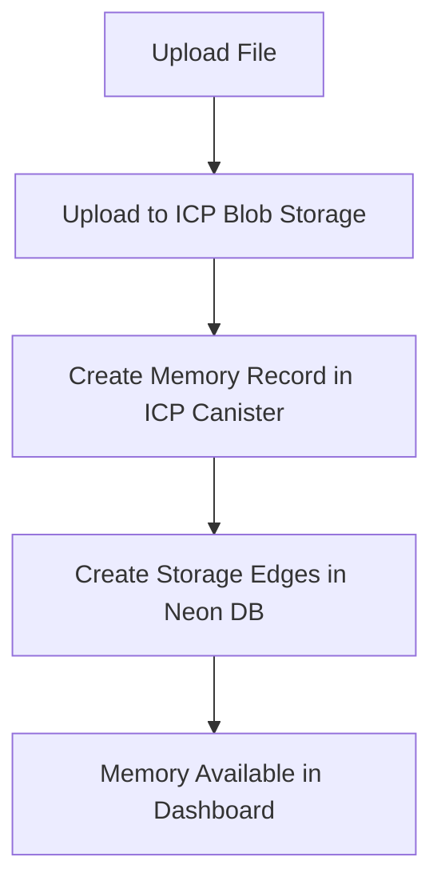
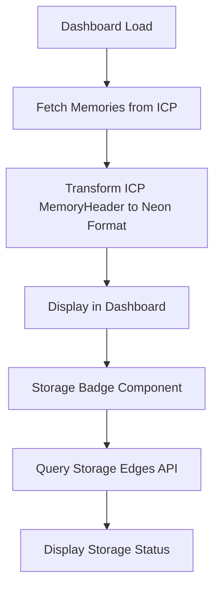

# ICP Memory Retrieval Flow Analysis

## Issue Summary

**Problem**: After uploading a memory to ICP, the system queries the `storage_edges` table to determine where the memory is stored. This raises questions about the memory retrieval flow and whether we're following the correct pattern.

**Status**: `OPEN` - Analysis Required  
**Priority**: `MEDIUM`  
**Assigned**: Tech Lead  
**Created**: 2024-12-19

## Questions to Investigate

### 1. Memory Retrieval Flow

- **Current Flow**: Upload to ICP → Create storage edges → Query storage edges to find memory location
- **Question**: Is this the correct flow, or should we be querying ICP directly for memory data?
- **Concern**: Are we creating unnecessary complexity by using storage edges as the primary lookup mechanism?

### 2. Storage Edges Purpose

- **Current Understanding**: Storage edges track where each memory artifact (metadata, assets) is physically stored
- **Question**: Should storage edges be the primary way to locate memories, or just a tracking mechanism?
- **Alternative**: Should we query ICP canister directly for memory data and only use storage edges for cross-system operations?

## Current Implementation Analysis

### Memory Upload Flow (ICP)



### Memory Retrieval Flow (Current)



### Storage Edges Query Pattern

```typescript
// Current pattern in useMemoryStorageStatus
const response = await fetch(`/api/storage/edges?memoryId=${memoryId}`);
```

## Key Questions

### 1. Primary Data Source

- **Question**: Should ICP memories be retrieved directly from ICP canister or through storage edges?
- **Current**: Direct from ICP canister for memory data, storage edges for status
- **Alternative**: All data through storage edges as single source of truth

### 2. Storage Edges Role

- **Question**: Are storage edges meant to be the primary lookup mechanism or just a tracking system?
- **Current**: Used for storage status display
- **Alternative**: Could be used as primary memory location registry

### 3. Performance Implications

- **Question**: Is querying storage edges for every memory status check efficient?
- **Current**: Separate API call for each memory's storage status
- **Alternative**: Batch queries or embed storage info in memory data

## Technical Analysis

### ICP Memory Structure

```rust
// From backend/src/memories/types.rs
pub struct Memory {
    pub id: String,                    // UUID v7
    pub capsule_id: String,            // Capsule context
    pub metadata: MemoryMetadata,      // title, description, etc.
    pub access: MemoryAccess,          // permissions
    pub inline_assets: Vec<MemoryAssetInline>,
    pub blob_internal_assets: Vec<MemoryAssetBlobInternal>,
    pub blob_external_assets: Vec<MemoryAssetBlobExternal>,
}
```

### Storage Edges Structure

```typescript
// From db/schema.ts
export const storageEdges = pgTable("storage_edges", {
  id: uuid("id").primaryKey().defaultRandom(),
  memoryId: uuid("memory_id").notNull(),
  memoryType: memory_type_t("memory_type").notNull(),
  locationMetadata: text("location_metadata"), // 'neon', 'icp', etc.
  locationAsset: text("location_asset"), // 's3', 'icp', etc.
  present: boolean("present").default(true),
  // ... other fields
});
```

## Potential Issues

### 1. Data Consistency

- **Risk**: Storage edges might become out of sync with actual ICP memory data
- **Impact**: Incorrect storage status display
- **Mitigation**: Regular sync checks or direct ICP queries

### 2. Performance

- **Risk**: Multiple API calls for each memory's storage status
- **Impact**: Slower dashboard loading
- **Mitigation**: Batch queries or embed storage info

### 3. Complexity

- **Risk**: Two different data sources for memory information
- **Impact**: Harder to maintain and debug
- **Mitigation**: Clear separation of concerns or unified approach

## Recommendations

### Option 1: Direct ICP Queries (Current)

- **Pros**: Single source of truth, real-time data
- **Cons**: Requires ICP authentication, slower for batch operations
- **Use Case**: When you need real-time, accurate data

### Option 2: Storage Edges as Primary

- **Pros**: Fast queries, no ICP authentication needed
- **Cons**: Potential data inconsistency, additional sync complexity
- **Use Case**: When you need fast batch operations

### Option 3: Hybrid Approach

- **Pros**: Best of both worlds
- **Cons**: More complex implementation
- **Use Case**: Use storage edges for listings, direct ICP for details

## Next Steps

1. **Analyze Current Usage**: Review how storage edges are currently used
2. **Performance Testing**: Compare direct ICP vs storage edges query performance
3. **Data Consistency Check**: Verify storage edges accuracy against ICP data
4. **Architecture Decision**: Choose primary data source strategy
5. **Implementation Plan**: Update memory retrieval flow if needed

## Related Files

- `src/nextjs/src/hooks/use-memory-storage-status.ts` - Storage status queries
- `src/nextjs/src/services/memories.ts` - Memory retrieval logic
- `src/nextjs/src/app/api/storage/edges/route.ts` - Storage edges API
- `src/backend/src/memories/types.rs` - ICP memory structure
- `src/nextjs/src/db/schema.ts` - Storage edges schema

## Acceptance Criteria

- [ ] Clear understanding of memory retrieval flow
- [ ] Performance analysis of current approach
- [ ] Data consistency verification
- [ ] Architecture decision documented
- [ ] Implementation plan if changes needed
