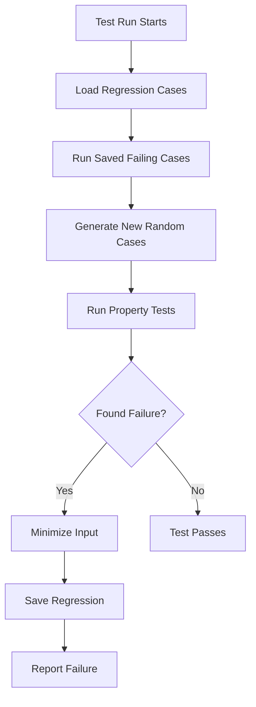
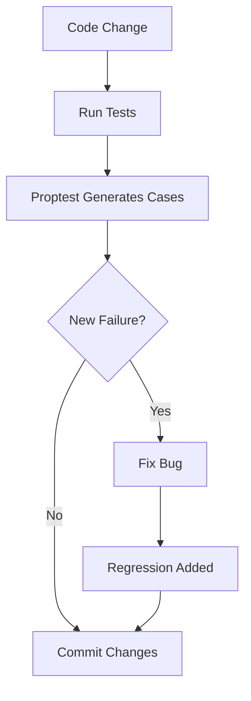

# Proptest Regressions - Quality Assurance for Capsule Storage

## Overview

This directory contains **proptest regression files** that ensure our capsule storage implementation remains robust against edge cases discovered during property-based testing.

## What is Proptest?

**Proptest** is a property-based testing framework for Rust that generates random test inputs to verify code correctness under various scenarios. Unlike traditional unit tests that use hardcoded values, proptest explores the input space systematically.

## Regression Testing Mechanism

When proptest discovers a failing test case, it:

1. **Minimizes** the failing input to the smallest possible example
2. **Stores** the seed and input that caused the failure
3. **Re-runs** these cases in future test executions

## Files in This Directory

### `capsule_store/integration_tests.txt`

**Status**: Active regression file for capsule storage property tests

**Discovery Date**: Recent property test implementation
**Issue Type**: Index consistency edge case
**Impact**: Medium (revealed Principal/ID validation gaps)

#### The Failing Case

The regression file contains a specific sequence of operations that exposed edge cases:

```rust
operations = [
    Upsert { id: "", subject: Principal { len: 0, ... } },  // Empty ID + invalid Principal
    Upsert { id: "㈠", subject: Principal { len: 1, ... } }, // Valid ID + valid Principal
    // ... more operations with empty IDs and invalid Principals
]
```

#### Root Cause

The test revealed that our implementation didn't properly handle:

- **Empty string IDs** (`""`)
- **Invalid Principals** with `len=0` or malformed byte arrays
- **Subject index lookups** for edge case inputs

#### Resolution

1. **Enhanced validation** in test capsule creation functions
2. **Better error handling** for malformed inputs
3. **Improved Principal validation** throughout the codebase
4. **Added regression test** to prevent future regressions

## Why This Matters

### Quality Assurance Benefits

1. **Edge Case Detection**: Finds bugs traditional testing misses
2. **Regression Prevention**: Ensures fixed bugs don't reappear
3. **Comprehensive Testing**: Tests thousands of input combinations
4. **Team Confidence**: Validates code correctness under stress

### Project-Specific Value

For the **Capsule Storage Foundation**, regression testing is crucial because:

- **Persistent Storage**: Bugs in stable memory could corrupt data permanently
- **Multi-user System**: Edge cases with Principals and IDs are common
- **Production Critical**: Storage layer bugs affect all application features
- **Migration Safety**: Ensures safe transition from volatile to persistent storage

## How Regression Testing Works

### Test Execution Flow



### Regression File Format

```
# Header comments explaining the file purpose
cc <seed_hash> # shrinks to <minimal_failing_input>
```

Example:

```txt
# Seeds for failure cases proptest has generated in the past
cc 7e8e5e1c55f3e0200fd5c112d0d46251c98deb0e5926eac1dca377960d043e9e
```

## Maintenance Guidelines

### When to Update

- **Add**: When proptest finds new failing cases (automatic)
- **Review**: During code changes that might affect storage logic
- **Clean**: Periodically remove outdated regressions (rare)

### Best Practices

1. **Always commit** regression files to version control
2. **Include in CI** to ensure all environments test the same cases
3. **Document findings** when regressions are added
4. **Review periodically** to ensure they remain relevant

## Integration with Development Workflow

### Development Process



### CI/CD Integration

```yaml
# Example CI configuration
test:
  - cargo test --release
  - cargo test --features proptest # Ensure regression tests run
  - check proptest-regressions/ files are up to date
```

## Future Enhancements

### Planned Improvements

1. **More Property Tests**

   - Index performance verification
   - Concurrency stress testing
   - Memory usage validation

2. **Extended Coverage**

   - Network-related edge cases
   - Time-based scenarios
   - Large dataset performance

3. **Integration Testing**
   - Cross-canister interaction testing
   - Upgrade scenario validation
   - Migration path verification

## Conclusion

The proptest regression files in this directory represent our commitment to **robust, battle-tested storage infrastructure**. By systematically testing edge cases and maintaining regression coverage, we ensure the capsule storage foundation remains reliable as the system evolves.

These files are not just artifacts—they're **guards against future regressions** and **documentation of past challenges overcome**.

---

_Generated as part of Phase 3.1: Dual-Backend Test Harness implementation_
_Last updated: Current development cycle_
